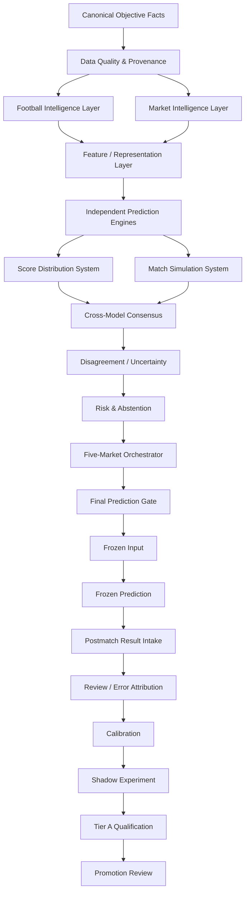
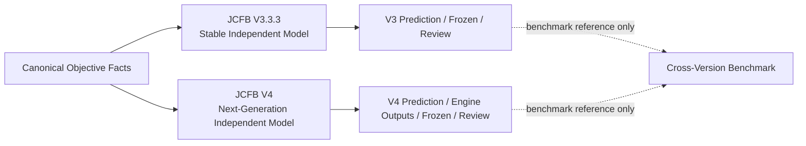

# JCFB V4.0 Architecture Blueprint 1.0

Status: V4-004 COMPLETE

## 1. Purpose and scope

This blueprint defines the V4 architecture, ownership boundaries, artifact lineage, and lifecycle from objective facts to post-match learning. It is an architecture and documentation artifact only. It does not implement a Score Engine, Prediction Engine, database schema, model training, production parameters, or a public web application.

JCFB V4.0 is an independent next-generation football prediction system. JCFB V3.3.3 remains a stable independent model. V4 may inherit validated process ideas, but its prediction core, configurations, outputs, frozen predictions, reviews, and sample qualification remain V4-owned.

## 2. Non-negotiable invariants

1. V3.3.3 and V4 remain permanently independent.
2. V4 work never modifies V3.3.3 code, history, Frozen Prediction, Review, Tier A records, or model parameters.
3. Only canonical, timestamped, provenance-preserving objective facts may be shared.
4. Predictions, model outputs, Frozen Prediction, confidence, review conclusions, Tier A qualification, and model parameters are never shared across model lines.
5. A pre-match run uses only information available by its declared cutoff. Future odds and post-match information are prohibited.
6. Every important artifact is auditable, reproducible, hashable, and attributable to a model version and run role.
7. Frozen Input precedes Frozen Prediction. A frozen prediction is immutable and append-only.
8. Production, Shadow, and Experiment outputs remain distinguishable and cannot silently cross roles.
9. Missing or conflicting information is explicit: `UNKNOWN`, `UNAVAILABLE`, `CONFLICT`, `BLOCKED`, or `NOT_IMPLEMENTED`.
10. No automatic promotion occurs without a formal Promotion Review.

## 3. System topology



### 3.1 Coexistence topology



The two model chains may read the same objective fact snapshot. After the shared-facts boundary, every feature bundle, model run, output, confidence value, freeze record, review conclusion, and qualification decision is isolated by model line.

## 4. Layered architecture

| Stage | V4-owned responsibility | Primary artifacts | Hard boundary |
|---|---|---|---|
| Canonical Objective Facts | Normalize match, odds, market, team, and result facts | Canonical fact records, snapshots | Does not generate predictions or conclusions |
| Data Quality & Provenance | Validate identity, timestamps, completeness, source reliability, freshness, and future-information risk | Quality scores, blockers, provenance records | A blocked critical fact set cannot enter Production Prediction |
| Football Intelligence | Convert time-valid football context into structured features | `football_features`, context confidence, conflicts, risk flags | Does not output final market predictions or alter official odds |
| Evidence Graph | Track each intelligence claim and its evidence lifecycle | Claims, evidence hashes, contradiction state | Unsupported claims cannot become trusted context silently |
| Market Intelligence | Interpret official and external market time series as signals | Market features, movement, divergence, heat, trap risk | Trap risk is a risk signal, never a fact about intent |
| Feature / Representation | Produce versioned, timestamped, reproducible feature bundles | Feature bundles, `feature_snapshot_hash` | Engines do not read unstandardized raw input directly |
| Independent Prediction Engines | Produce separate market and score judgments | Per-engine outputs and hashes | No single engine mechanically owns all five markets |
| Score Distribution | Estimate a full score probability distribution through a V4-defined interface | Lambda inputs, score matrix, distribution | Production algorithm is not selected by this blueprint |
| Score Selection | Generate and rank diverse score candidates | Top20 candidates, Top1/2/3/5/10 selections | Selection cannot rewrite the underlying distribution |
| Match Simulation | Explore state transitions and match scripts independently | Simulation summaries, scripts, variances | Simulation cannot read official results during a pre-match run |
| Consensus / Disagreement / Uncertainty | Preserve raw engine evidence and quantify agreement and uncertainty | Votes, conflicts, disagreement, confidence interval | Consensus is not a simple probability average; probability is not confidence |
| Risk & Abstention | Turn data, context, market, upset, volatility, and model conflict into a gate | Risk flags, `PASS`, `CAUTION`, `ELIGIBLE`, `HIGH_CONFIDENCE`, abstention | The system may return `NO STRONG RECOMMENDATION` |
| Five-Market Orchestrator | Organize SPF, RQSPF, Total Goals, Exact Score, and Half-Full outputs | Orchestrated prediction package | Independent engine output comes first; cross-market consistency comes second |
| Final Prediction Gate | Enforce identity, odds, timestamp, quality, completeness, consistency, and risk prerequisites | Gate decision and rejection reasons | Failed prerequisites cannot produce a formal prediction |
| Frozen Input | Freeze every pre-match input and version used for a run | Frozen input record, `frozen_input_hash` | Production, Shadow, and Experiment comparisons require the same frozen input |
| Frozen Prediction | Persist immutable V4 output and lineage | Frozen prediction, `output_hash`, `frozen_at` | No in-place edits; revisions are append-only and supersede explicitly |
| Postmatch Review | Compare a frozen prediction with the official result | Prediction evaluation, review evidence | Review cannot overwrite frozen prediction or feed pre-match history |
| Calibration / Error Attribution | Measure reliability and diagnose errors without retroactive parameter edits | Calibration metrics, diagnostic attribution | A single result cannot directly change a model parameter |
| Shadow / Tier A / Promotion | Evaluate alternatives under controlled roles | Shadow runs, V4 Tier A samples, promotion review | Shadow and Experiment cannot affect Production silently |
| Public Read Projection | Publish an immutable read projection | Canonical latest update, read cache | Public Web is read-only and never runs a model |

## 5. Shared facts and isolated model chains

The Shared Objective Facts Layer is the only planned cross-version read boundary. It includes canonical match identity, competition, kickoff time and timezone, home and away teams, official handicap, official China Sports Lottery odds, market availability, timestamped snapshots, external market facts, team and match facts, and official results.

The shared layer must preserve `source`, `source_timestamp`, `observed_at`, `ingested_at`, `confidence`, `provenance`, and `hash`. A V3.3.3 or V4 consumer receives a read-only, time-bounded fact snapshot. The consumer then creates its own V4 or V3-derived feature and model artifacts.

The following are V4-private artifacts and must not enter the shared facts layer:

- prediction and model output
- Frozen Prediction and Frozen Input
- confidence, uncertainty, risk, and abstention decisions
- review conclusions and error attribution conclusions
- Tier A qualification
- model parameters, engine configuration, and implementation details

The formal field-level rules are defined in `V4_SHARED_FACTS_CONTRACT.md`.

## 6. Data quality and evidence

`Data Quality Engine 4.0` runs before the feature layer. It evaluates:

- identity completeness
- odds completeness and official-odds gate
- timestamp validity and kickoff validity
- market availability
- source reliability and provenance
- duplicate snapshots and stale data
- conflicting sources and missing context
- future-information risk

It produces `DATA_QUALITY_SCORE`, `ODDS_QUALITY_SCORE`, `CONTEXT_QUALITY_SCORE`, `SOURCE_CONFIDENCE`, and `BLOCKERS[]`. Any critical blocker rejects a Production Prediction and is retained in the audit record.

`Evidence Graph 1.0` gives each intelligence claim a lifecycle: `claim`, `source`, `published_at`, `retrieved_at`, `valid_from`, `expires_at`, `confidence`, `contradiction_state`, and `evidence_hash`. Expired, contradictory, or unsupported claims remain visible and cannot be silently treated as valid context.

## 7. Intelligence and representation

`Football Intelligence Engine 4.0` is independent from `Market Intelligence Engine 4.0`. Football Intelligence may include team strength, recent form, opponent adjustment, attack, defence, home/away profile, league profile, availability, Starting XI, coach, tactical style and matchup, motivation, schedule pressure, fatigue, travel, weather, and pitch. Its outputs are features, confidence, conflicts, and risk flags, not final SPF, score, or other market predictions.

Market Intelligence may include opening baseline, odds movement, velocity, price compression/expansion, cross-market confirmation/divergence, heat, overreaction, reverse movement, late movement, liquidity/availability quality, and trap-risk signals. Trap or 诱盘 analysis is never promoted to a fact about bookmaker intent.

The Feature Representation Layer creates versioned bundles for statistical, football-context, market, league, tactical, score, and quality features. Each bundle is timestamped, hashable, reproducible, and represented by a `feature_snapshot_hash`.

## 8. Multi-engine prediction architecture

V4 uses a multi-engine architecture. The minimum planned engine set is:

1. `Outcome Engine 4.0` — Home / Draw / Away probability
2. `Handicap Engine 4.0` — handicap outcome and goal-difference distribution
3. `Goals Engine 4.0` — 0–7+ goal distribution and goal bands
4. `HTFT Engine 4.0` — nine Half-Full states
5. `Score Engine 4.0` — full exact-score probability distribution
6. `Upset Engine 4.0` — independent favorite-failure and upset probability

Every engine run must support `engine_version`, `implementation_hash`, `config_hash`, `input_hash`, `output_hash`, `run_at`, and `runtime_ms`. Raw engine outputs are retained; downstream layers may annotate or gate them but may not silently replace them.

The `Five-Market Prediction Orchestrator 4.0` organizes SPF, RQSPF, Total Goals, Exact Score, and Half-Full. Each market is independently modeled first. Cross-market consistency is checked second. Outcome output is not mechanically copied into every other market.

## 9. Statistical and score architecture

`Statistical Strength Model 4.0` is planned to support Dynamic Team Rating, attack and defence ratings, home advantage, opponent adjustment, form decay, league strength, and promotion/relegation adjustment. It must be time-decay aware, sample-size aware, and opponent adjusted; a short winning streak is not by itself a sufficient reason for a large rating change.

`Score Engine 4.0` is a separate system with the following planned interfaces:

```text
Attack Expectation
+ Defence Expectation
+ League Prior
+ Home Advantage
+ Team Context Adjustment
+ Market Goal Signal
+ Tactical Adjustment
        ↓
Dynamic Lambda Engine
        ↓
Distribution Ensemble
        ↓
Goal Variance / Correlation
        ↓
Score Matrix
        ↓
Candidate Generator
        ↓
Score Re-Ranker
        ↓
Exact Score Selector
```

The interface plans Dynamic λ Home, Dynamic λ Away, BTTS, Clean Sheet, Goal Variance, Distribution Ensemble, Correlation Adjustment, and Score Matrix components. Poisson, Dixon-Coles, Bivariate Poisson, and Negative Binomial/over-dispersion are research candidates only. This blueprint does not select a Production algorithm or parameters.

Score Distribution and Score Selection are separate contracts. `Score Candidate Generator 4.0` produces at least Top20 candidates. `Exact Score Selector 4.0` can expose Top1, Top2, Top3, Top5, and Top10. `Scenario Diversity Selector` prevents adjacent score candidates from representing one repeated match script while excluding materially different scripts.

## 10. Simulation, scripts, consensus, and uncertainty

`Match Simulation Engine 1.0` is an independent layer. It may support future Monte Carlo runs without fixing the run count at Blueprint stage. State nodes are 0', 15', 30', HT, 60', 75', and FT. Planned stochastic factors include goal events, game state, leading/trailing behavior, tempo, fatigue, substitution depth, red-card events, and tactical shifts.

`Match Script Engine 4.0` identifies `HOME_CONTROL`, `AWAY_CONTROL`, `BALANCED_LOW_EVENT`, `BALANCED_OPEN`, `HOME_EARLY_LEAD`, `AWAY_EARLY_LEAD`, `LATE_BREAK`, `HIGH_VARIANCE`, `COMEBACK_PRONE`, and `DRAW_PRESSURE`. A script may affect simulation, reranking, risk, and scenario diversity. It cannot replace the score distribution.

`Cross-Model Consensus Engine 4.0` consumes statistical, football, market, outcome, goals, score, simulation, and upset outputs. It produces `CONSENSUS_SCORE`, `DIRECTIONAL_CONSENSUS`, `MODEL_VOTES`, `ENGINE_SUPPORT`, and `ENGINE_CONFLICTS`. It must preserve the original outputs and cannot be defined as a simple average.

`Model Disagreement Index 1.0` distinguishes shared agreement from coincidental averaging and outputs `LOW`, `MEDIUM`, `HIGH`, or `EXTREME` plus `numeric_disagreement_score`.

`Uncertainty Engine 4.0` considers data, context, market, model disagreement, distribution entropy, simulation variance, calibration reliability, missing evidence, and league sample quality. It outputs prediction uncertainty, confidence intervals, and confidence grade. Probability and confidence are separate concepts.

`Risk & Abstention Engine 4.0` evaluates data, market, context, upset, volatility, and model-conflict risk. It may return `PASS`, `CAUTION`, `ELIGIBLE`, `HIGH_CONFIDENCE`, or `NO STRONG RECOMMENDATION`. The system is not required to produce a strong recommendation for every match.

## 11. Gates and immutable artifacts

The Final Prediction Gate requires:

```text
MATCH_IDENTITY = PASS
OFFICIAL_ODDS = PASS
TIMESTAMP_VALIDITY = PASS
NO_FUTURE_DATA = PASS
DATA_QUALITY != BLOCKED
CONTEXT_QUALITY != BLOCKED
ENGINE_OUTPUTS_COMPLETE = PASS
CONSISTENCY_CHECK = PASS or ACCEPTABLE
RISK_GATE != BLOCKED
```

Before Frozen Prediction, `Frozen Input 4.0` freezes match identity, odds snapshots used, team context, market context, feature snapshot, model versions, and engine configurations. It produces `frozen_input_hash`. Production, Shadow, and Experiment comparisons are valid only when they use the same frozen input hash.

`Frozen Prediction 4.0` stores the five-market outputs, engine-output references, score-distribution reference, simulation summary, consensus, disagreement, uncertainty, risk, model version, input hash, output hash, and `frozen_at`. It is immutable. A later correction is a new append-only revision with a `supersedes` pointer and complete audit trail.

The complete product/component version tuple, selector identity, config/schema/migration/dataset versions, role-scoped revisions, and hash contract are defined in `docs/V4_VERSIONING_STANDARD.md` and `docs/V4_VERSION_IDENTITY_CONTRACT.md`. Compatibility and release naming are governed by the companion V4-006 policies.

## 12. Roles and lifecycle after freeze

| Role | Purpose | Allowed effect |
|---|---|---|
| `PRODUCTION` | The only formal output path | May produce the official V4 prediction after all gates pass |
| `SHADOW` | Pre-match comparison without public authority | May run against the same Frozen Input; never changes Production |
| `EXPERIMENT` | Research and hypothesis evaluation | May be incomplete or exploratory; never appears in formal public prediction |

`Postmatch Review Engine 4.0` takes Frozen Prediction plus Official Result. Later match statistics may be attached as post-match evidence, but they remain separate from pre-match model evaluation. Prediction Evaluation and Match Explanation are distinct outputs.

`Error Attribution Engine 4.0` may classify data, context, market interpretation, outcome, handicap, goals, lambda, variance, distribution, ranking, selector, simulation, calibration, upset, consensus, and uncertainty errors. It produces diagnostic evidence; a single match result cannot directly rewrite model parameters.

`Calibration Engine 4.0` plans Brier Score, Log Loss, calibration curve, reliability, and sharpness by league, market, confidence band, and model version.

V4 Tier A qualification restarts at `V4 Tier A Sample #001`. A minimum candidate requires Frozen Input, Production Output, Shadow Output when A/B is required, pre-kickoff outputs, Official Result, no future leakage, implementation/config/input/output hashes, and a passing completeness gate. V3.3.3 Tier A numbers and labels are not V4 samples.

## 13. Benchmark and performance architecture

`Cross-Version Benchmark` freezes V3.3.3 and V4 independently for the same canonical match. It may compare SPF, RQSPF, Goals, Score Top1/2/3/5, HTFT, Brier Score, Log Loss, calibration, upset detection, abstention quality, score coverage, Total Goals MAE, and Goal Difference MAE. It never edits or merges V3.3.3 outputs.

The performance rule is **Compute Once, Read Many**. If `input_hash` is unchanged, expensive upstream work should not be repeated without a declared reason. Cache, reuse, and incremental recomputation are allowed only with versioned cache keys and invalidation. A selector-version change may later rerun the re-ranker and selector without relaunching unchanged upstream data and distribution work.

## 14. Public projection

The public architecture is read-only:

```text
Model Compute
    ↓
Canonical Prediction Store
    ↓
Public Read Projection
    ↓
Web
```

It may support incremental publish, cache, lazy loading, and `canonical_latest_update`. Public Web never runs a model, mutates a prediction, or bypasses the freeze and gate layers. Web implementation is out of scope for V4-004.

## 15. Explicitly deferred work

The following remain outside this Blueprint task:

- Score Engine implementation or Production algorithm selection
- Prediction Engine implementation
- Simulation implementation or fixed run count
- database migrations and Supabase changes
- model training, backtesting, and parameter tuning
- Production or Shadow execution
- historical odds, match, or Tier A import
- V3.3.3 changes or migration
- V4-007 Production / Shadow / Experiment Boundary and later tasks
