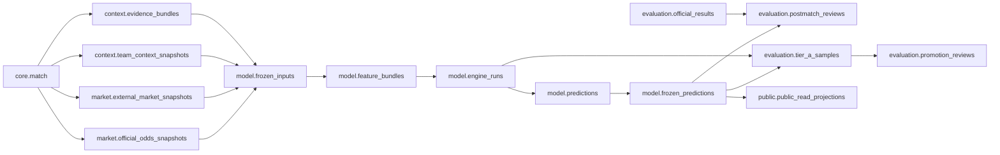

# JCFB V4 Database Schema Blueprint 1.0

Status: V4-010 DATABASE SCHEMA BLUEPRINT (DESIGN-ONLY)

## 1. Authority, scope, and hard boundary

This document translates the accepted V4-008 contracts and V4-009 logical data model into a PostgreSQL/Supabase physical schema design. It is a review artifact only.

This blueprint does not create a database, run SQL, apply a migration, write to Supabase, execute a model, run Production/Shadow/Experiment, publish a prediction, tune parameters, or modify JCFB V3.3.3. The companion SQL file is explicitly non-runnable design material: `database/schema/v4_schema_blueprint.sql`.

Authority order:

1. `docs/V4_CONSTITUTION.md`.
2. The affected V4-008 contract and V4-009 logical model.
3. `docs/V4_VERSIONING_STANDARD.md`, `docs/V4_RUNTIME_ROLE_BOUNDARY.md`, and the V4 governance contracts.
4. This physical design and its companion catalogs.

Any unresolved physical decision is `TODO_DECISION` and blocks a real migration until reviewed. No physical convenience may weaken a higher-order rule.

## 2. Recommended namespace design

The recommended deployment uses seven PostgreSQL schemas. `market` and `context` are physical subdomain boundaries of the V4-009 logical `core` ownership model; they do not create a second source of truth.

| Schema | Owner/boundary | Tables and objects | Exposure |
|---|---|---|---|
| `core` | canonical identity and objective facts | `competitions`, `teams`, `team_aliases`, `matches` | private; backend and approved fact readers only |
| `market` | source-isolated market observations | `official_odds_snapshots`, `external_market_snapshots` | private; no browser table access |
| `context` | time-valid context and evidence | `team_context_snapshots`, normalized context-evidence links, `evidence_items`, `evidence_bundles`, `evidence_bundle_items` | private; no browser table access |
| `model` | frozen lineage and role-owned runtime | Frozen Inputs, Feature Bundles, Engine Runs, Predictions, Frozen Predictions, normalized lineage joins | private; role-scoped service access |
| `evaluation` | postmatch, Tier A, promotion, calibration | Results, Reviews, Tier A, Promotion, Calibration and their joins | private; controlled review/promotion services |
| `governance` | registry, release pointers, incidents, audit | Model/Engine registries, pointer events, Incidents, Audit Logs | private; admin/service functions only |
| `public` | safe read model | `public_read_projections` plus explicit-column read views | only allow-listed views to `anon`/`authenticated` |

`public` is not a dumping ground for source, model, or evaluation tables. The projection ledger is safe-by-construction and has no client write policy. Internal columns used to prove publication may exist in the ledger, but they are not granted to browser roles. The public views expose only allow-listed fields.

### 2.1 Single-schema alternative

A single `public` schema with name prefixes (for example, `v4_model_predictions`) is rejected as the recommended design. It has less migration ceremony, but it weakens grant review, increases accidental Data API exposure, makes source/model ownership less visible, and complicates RLS audits. It remains a possible compatibility fallback only if every table is RLS-protected, client grants are revoked by default, private objects are not exposed, and the same ownership/trigger rules are retained. That fallback requires a new governance decision; it is not the V4-010 target.

## 3. Type and storage decisions

| Concern | V4-010 decision | Rationale and boundary |
|---|---|---|
| IDs | `uuid` for business/object identities; portable candidate default is `gen_random_uuid()` | UUID/UUIDv7 remains the contract. UUIDv7 is preferred for high-write tables when the deployed version/extension is approved. `TODO_DECISION`: select the UUIDv7 function and extension before Phase 1; never silently change historical IDs. |
| Audit/sample order | `bigint GENERATED ALWAYS AS IDENTITY` in `governance.audit_logs.audit_log_id` and `evaluation.tier_a_samples.sample_no`, alongside UUID object identity where applicable | Hash-chain order and V4 Tier A numbering need a monotonic database sequence. The sequence is not a substitute for a UUID entity identity. |
| Time | `timestamptz` for all instants | `date` only for lottery `data_date` and declared evaluation windows. Timezone is retained explicitly where it changes interpretation. |
| Probabilities/metrics | `numeric(12,9)` for probabilities and canonical persisted metrics | Exact decimal comparison and reproducible serialization. `double precision` is reserved for non-canonical telemetry such as runtime measurements or model-native arrays where the contract explicitly permits it; a float is never used as a business key. |
| Odds/lines | `numeric(12,4)` for decimal odds/prices and `numeric(8,3)` for handicaps/lines | Avoid binary floating-point drift while accepting external provider precision. Positive odds are checked; a line may be negative, zero, or positive according to its market. |
| Status/role/enum values | `text` plus table-level `CHECK` constraints | Avoid PostgreSQL enum alteration coupling. Values remain the exact governed V4 spellings; unknown values fail closed. A future enum-to-domain change is a compatibility decision, not an in-place reinterpretation. |
| Structured payload | `jsonb` only for genuinely variable/complex contract payloads, explanations, distributions, warnings, metadata, and source envelopes | Core relationships, match identity, role, version identity, hashes, times, state, and query-critical fields are typed columns or normalized join tables. JSONB never replaces an FK. |
| Hashes | `text`, formatted as `sha256:<64 lowercase hex>`; `hash_algorithm` and `hash_profile` are explicit metadata | `char(64)` cannot carry the required algorithm prefix and pads values. Format checks are database-safe; canonicalization/recomputation remains a separately versioned application/function contract and is not fabricated in this blueprint. |
| Secret material | never stored in any table, payload, metadata, SQL, or repository file | Only non-secret configuration identity (`config_version`, `config_hash`) is persisted. Secrets remain in approved runtime secret storage. |

## 4. Common column policy

Formal rows use the common metadata defined in `V4_DATA_CONTRACT.md` where applicable: `contract_version`, `schema_version`, `created_at`, `source`, `source_type`, `source_reference`, source/observation/ingestion times, provenance/payload hashes, status, and metadata.

`created_at timestamptz NOT NULL DEFAULT now()` is the database insertion timestamp and never substitutes for a business timestamp. Append-only tables intentionally have no mutable `updated_at`. Registry tables have `updated_at timestamptz NOT NULL DEFAULT now()` and a controlled trigger may change it only for approved pointer/status metadata transitions with an audit event. A row's identity, role, version, payload, source, cutoff, kickoff, and hash fields are never changed by that trigger.

Source-derived tables use `availability_at timestamptz` plus `availability_time_state` and `availability_time_basis`. A known time must have a value and a declared basis (`SOURCE_TIMESTAMP`, `PUBLISHED_AT`, or `OBSERVED_AT`); an unknown/blocked time stays NULL with an explicit state and reason. `ingested_at` is audit telemetry only.

The persisted canonical hash vocabulary is explicit: `implementation_hash`, `config_hash`, `input_hash`, `output_hash`, `payload_hash`, `provenance_hash`, `frozen_input_hash`, `prediction_hash`, `result_hash`, and `review_hash`, with `hash_algorithm` and `hash_profile` stored on canonical envelopes. Relation rows carrying `used_*_hash` inherit the referenced envelope's algorithm/profile. The database validates only the declared `sha256:<64 lowercase hex>` format; it does not invent canonical bytes or recompute a digest in this blueprint.

## 5. Physical lineage



The normalized child tables `context.team_context_evidence`, `context.evidence_bundle_items`, `model.frozen_input_*`, `model.prediction_engine_runs`, `evaluation.tier_a_run_members`, and `evaluation.promotion_review_samples` carry exact relationships that must not be hidden in arrays or JSONB.

## 6. Constraint strategy

### 6.1 Constraints that PostgreSQL can express directly

- UUID primary keys and typed foreign keys.
- `UNIQUE(core.matches.data_date, official_match_no)`.
- Snapshot dedup keys, Frozen Input revision keys, Prediction logical uniqueness, Frozen Prediction revision uniqueness, result/review revision uniqueness, and join membership uniqueness.
- Non-null, range, format, role, state, source-official, market, side, and availability checks.
- Home and away teams are different.
- Partial unique indexes for one active Production registry row per family/channel.
- Hash format checks and explicit boolean gate invariants.

### 6.2 Constraints requiring a trigger or controlled function

- Same-match checks across redundant `match_id` columns and child joins.
- Frozen Input selected ID/hash agreement and cutoff eligibility.
- `prediction.match_id = frozen_input.match_id` and every cited Engine Run has the same match and role.
- Frozen Prediction/Prediction same-match, same-role, and snapshot-hash agreement.
- Review Result/Frozen Prediction same-match agreement and Model Evaluation versus Match Explanation input separation.
- Tier A Production/Shadow same-match, distinct-role, same `frozen_input_hash`, pre-kickoff completion, and Experiment denial.
- Role immutability and registry role/version consistency.
- Revision predecessor family, monotonic revision, no cycles, and supersession evidence.
- Official versus external source separation and market payload availability.
- No-future-leakage and fail-closed gate evaluation.
- Audit event creation and hash-chain serialization.

The named functions and trigger contracts are specified in `V4_CONSTRAINT_CATALOG.md` and `V4_TRIGGER_BLUEPRINT.md`. A failed critical gate raises an error or records a non-eligible `BLOCKED`/`INVALID` row; it never repairs the input silently.

## 7. No-future-leakage database gate

Every formal pre-match chain must prove:

```text
all selected availability_at <= prediction_cutoff_at
AND prediction_cutoff_at < kickoff_at
AND model_run_at < kickoff_at
AND frozen_at < kickoff_at
AND future_information_leakage = FALSE
AND run_invalid = FALSE
AND no result/event/postmatch reference exists in the pre-match input set
AND every selected ID and hash resolves exactly
```

The database gate reads typed source times and normalized selection tables. If a critical time is NULL/UNKNOWN, a hash is missing, a reference cannot be resolved, a time is after cutoff, or a forbidden postmatch object is present, the formal artifact is rejected or stored as ineligible with `BLOCKED`/`INVALID`. A row cannot be made eligible by changing a flag alone.

`model.engine_runs` and `model.frozen_predictions` carry both the comparison times and the gate flags so the decision is reconstructable. The exact source of each selected time remains in the upstream row and audit log.

## 8. Role and Production isolation

Every role-owned runtime row has a required immutable `role` check: `PRODUCTION`, `SHADOW`, or `EXPERIMENT`. It also carries the exact model/engine registry identity, role revision, and hashes. Role is not inferred from a schema path, filename, process, or human label.

- Production is the only canonical prediction/publication role.
- Shadow is pre-match comparison evidence and cannot write Production or Public rows.
- Experiment is research-only and cannot be Forward Tier A or public.
- A Production/Shadow pair uses one shared Frozen Input identity/hash; `input_hash` and `output_hash` remain role-specific.
- An active Production release is an explicit registry/pointer identity. A partial unique index enforces at most one active row per `(model_family, canonical_output_channel)`; the activation function also appends a pointer event and audit record.
- Promotion creates a new Production identity. It never edits or relabels a Shadow/Experiment identity.

## 9. Append-only and revision policy

The strict append-only set is:

`market.official_odds_snapshots`, `market.external_market_snapshots`, formal `context.team_context_snapshots`, `context.team_context_evidence`, `context.evidence_items`, `context.evidence_bundles`, `context.evidence_bundle_items`, `model.frozen_inputs` after `FROZEN`, `model.feature_bundles` once used formally, `model.engine_runs`, `model.predictions`, `model.prediction_engine_runs`, `model.frozen_predictions`, `evaluation.official_results`, `evaluation.postmatch_reviews`, `evaluation.tier_a_samples`, `evaluation.tier_a_run_members`, `evaluation.promotion_reviews`, `evaluation.promotion_review_samples`, `evaluation.calibration_records`, `governance.incidents`, `governance.audit_logs`, and formal `public.public_read_projections`.

Correction means a new row with a direct `supersedes_*_id`, a new revision, a reason, actor/time evidence, and new hashes. Official Result and Review correction never updates the predecessor. Frozen Input can be edited only while a controlled `DRAFT` row has not been frozen; after `FROZEN`, any correction is a new input identity. Frozen Prediction is permanently immutable.

`model_versions` and `engine_versions` are registries with narrowly controlled updates to status/active/effective/retirement metadata. Identity fields and used hashes remain immutable; every permitted update is audited. Release pointer history is append-only.

## 10. Public read projection and latest update

The public projection contains only safe display fields, safe official-odds summary, canonical Production selection, frozen time, optional safe result summary, and typed business timestamps copied from the exact upstream records used by the publication gate. It contains no Shadow/Experiment identity, raw features, private payload, internal risk decomposition, secrets, or debug trace.

`public.v_canonical_latest_update` computes the maximum of the real business timestamps in the projection ledger: Prediction, Frozen Prediction, official odds, Team Context, Official Result, and Postmatch Review where present. Its row-level candidate expression is `GREATEST(prediction_business_at, frozen_business_at, odds_business_at, context_business_at, COALESCE(result_business_at, '-infinity'::timestamptz), COALESCE(review_business_at, '-infinity'::timestamptz))`; any multi-row aggregation then applies `MAX` to that derived business time. The view never uses page build time, deploy time, API response time, or a generic row `created_at` as a substitute. Publication must fail closed if any required source timestamp cannot be proven.

## 11. Security design summary

- RLS is enabled on every table, including private schemas as defense in depth.
- `anon` and ordinary `authenticated` have no direct table write grants and no private-table read grants.
- Public readers receive `SELECT` only on allow-listed `security_invoker` views (and only the minimum underlying safe columns required by those views when the deployed PostgreSQL version requires it).
- `service_role`/backend remains server-side. Controlled functions use fixed `search_path`, explicit actor checks, and least-privilege grants; `SECURITY DEFINER` is not used as a generic permission bypass.
- Internal authenticated access, if needed later, is granted through a dedicated internal claim/role path based on `raw_app_meta_data`, never editable user metadata.
- Secrets are not in Git, SQL, metadata, payloads, or public projections.

## 12. Companion artifacts

| Artifact | Boundary |
|---|---|
| `docs/V4_TABLE_CATALOG.md` | fields, types, NULL/default, PK/FK, table constraints, timestamp policy |
| `docs/V4_CONSTRAINT_CATALOG.md` | direct and trigger-enforced integrity rules |
| `docs/V4_INDEX_BLUEPRINT.md` | B-tree/partial/covering/BRIN/GiN and FK index design |
| `docs/V4_RLS_SECURITY_BLUEPRINT.md` | roles, grants, RLS policies, functions, public exposure |
| `docs/V4_TRIGGER_BLUEPRINT.md` | append-only, revision, time-gate, role, audit and correction triggers |
| `docs/V4_VIEW_BLUEPRINT.md` | public projection views and latest-update derivation |
| `docs/V4_MIGRATION_PLAN.md` | dependency-ordered phases, rollback limits and future smoke validation |
| `database/schema/v4_schema_blueprint.sql` | candidate DDL only; never auto-apply |

## 13. Schema Advisor checklist

Before a future migration is approved, review:

- RLS is enabled on every exposed table; intentional private/no-policy tables are recorded.
- Every `SECURITY DEFINER` function, if any, has a fixed `search_path`, actor check, and restricted `EXECUTE` grant.
- Every public view uses `security_invoker=true` where supported, explicit columns, and safe underlying grants.
- All foreign keys have supporting indexes or a documented low-cardinality exception.
- Partial unique predicates exactly match the active Production rule; no duplicate/overlapping indexes are created.
- `anon`, `authenticated`, `service_role`, custom backend roles, schema usage, table grants, sequence grants, and function execution are explicit.
- JSONB indexes are added only for proven containment/access patterns; core relationship columns remain typed.
- Extension placement and version availability are verified before use (`pgcrypto`/UUIDv7 are not assumed silently).
- Public schema/Data API exposure is reviewed independently of RLS; RLS is not treated as a substitute for `REVOKE`.
- No secret, password, token, service key, or database URL enters the migration or repository.

## 14. V3.3.3 boundary and acceptance

No table, FK, view, function, policy, seed, migration, or audit row in this blueprint references, copies, exposes, renames, or mutates JCFB V3.3.3 artifacts. V3.3.3 remains an independent protected model line.

V4-010 is acceptable only when all companion artifacts exist, the SQL is marked blueprint-only, Cross-Doc Consistency and Self Audit pass, Secret Scan and `git diff --check` pass, and Git traceability exists. This document does not authorize V4-011 migration execution.
