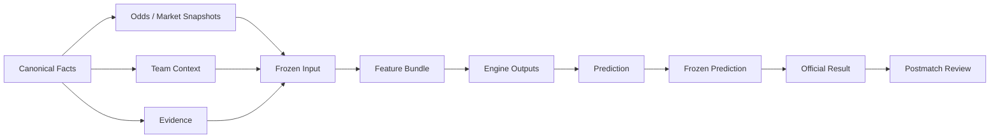

# JCFB V4 Data Contract 1.0

Status: V4-008 DATA CONTRACT DESIGN ARTIFACT

## 1. Authority, scope, and non-goals

This document is the umbrella contract for the JCFB V4 data interfaces. It standardizes the identity, provenance, time, availability, hashing, versioning, validation, and cross-contract behavior of V4 artifacts from Canonical Facts through Postmatch Review.

The authority order is:

1. `docs/V4_CONSTITUTION.md`
2. this umbrella contract and the contract named by the affected object
3. `docs/V4_VERSIONING_STANDARD.md`, `docs/V4_VERSION_IDENTITY_CONTRACT.md`, and `docs/V4_COMPATIBILITY_POLICY.md`
4. `docs/V4_ARCHITECTURE_BLUEPRINT.md`, `docs/V4_SHARED_FACTS_CONTRACT.md`, and `docs/V4_RUNTIME_ROLE_BOUNDARY.md`
5. implementation details that remain compatible with the rules above

This is a data-contract and schema-governance artifact. It does not create a database migration, write to Supabase, execute a model, run a prediction, run Shadow, publish Production, tune parameters, or modify JCFB V3.3.3.

The contract registry is:

| Contract | File | Primary boundary |
|---|---|---|
| Umbrella Data Contract | `V4_DATA_CONTRACT.md` | Shared rules, enums, hashes, IDs, compatibility, and flow |
| Canonical Facts Schema | `V4_CANONICAL_FACTS_SCHEMA.md` | Match identity and objective facts |
| Odds Snapshot | `V4_ODDS_SNAPSHOT_CONTRACT.md` | Official five-market and external market snapshots |
| Team Context | `V4_TEAM_CONTEXT_CONTRACT.md` | Time-valid structured football context |
| Evidence | `V4_EVIDENCE_CONTRACT.md` | Claim, provenance, verification, and contradiction lifecycle |
| Frozen Input | `V4_FROZEN_INPUT_CONTRACT.md` | Immutable pre-match input boundary |
| Feature Bundle | `V4_FEATURE_BUNDLE_CONTRACT.md` | Versioned, reproducible feature representation |
| Engine Output | `V4_ENGINE_OUTPUT_CONTRACT.md` | Common independent-engine envelope and payloads |
| Prediction | `V4_PREDICTION_CONTRACT.md` | Independent five-market prediction and Frozen Prediction |
| Result and Review | `V4_RESULT_REVIEW_CONTRACT.md` | Official result, model evaluation, and match explanation |

All ten files are required for V4-008 acceptance. The contracts are interfaces, not permission to begin V4-009 or any implementation task.

## 2. Global data-contract principles

Every formal object obeys these rules:

1. Every key object has a qualified `contract_version` such as `canonical-match@1.0.0`. A contract version is an auditable identity, not a display label.
2. Every key object has a stable identity. Display names, labels, filenames, and timestamps are never substituted for an identity.
3. Every key object supports a provenance hash and a payload hash. Specialized hashes such as `snapshot_hash`, `evidence_hash`, `frozen_input_hash`, `feature_hash`, `output_hash`, `prediction_hash`, and `result_hash` use the same canonicalization profile and are required where their contract names them.
4. Each time field has one meaning. `source_timestamp`, `published_at`, `observed_at`, `ingested_at`, `effective_at`, `captured_at`, `run_at`, `frozen_at`, `verified_at`, and `reviewed_at` are not interchangeable.
5. `UNKNOWN`, `UNAVAILABLE`, `NOT_VERIFIED`, `BLOCKED`, `NOT_APPLICABLE`, and technical `NULL` are separate states. An empty object, empty array, zero, or empty string cannot silently carry one of these meanings.
6. Objective Facts and Model Interpretation are different data classes. Facts may cross the approved read-only shared boundary; interpretations, predictions, confidence, risk, reviews, and parameters remain model-line private.
7. Engines consume only a versioned, frozen, typed interface. An Engine must not depend directly on free-form, unversioned JSON in a formal path.
8. Any backward-incompatible field type, meaning, unit, time boundary, requiredness, enum meaning, or hash rule is a `MAJOR` contract change under V4-006.
9. Frozen Input and Frozen Prediction are immutable. Corrections and revisions append a new object and preserve the old object and its hashes.
10. Pre-match contracts fail closed when availability, identity, source time, cutoff, or provenance cannot be proven.

## 3. Common metadata envelope

The fields below are the common metadata vocabulary. Requiredness is per persisted formal object; a contract-specific table may make a conditional field required for a particular object.

| Field | Type | Requiredness | Meaning and rule |
|---|---|---|---|
| `object_id` | string | REQUIRED for persisted key objects | Stable UUID/UUIDv7 identity. A human-readable alias is not a substitute. |
| `contract_version` | string | REQUIRED | `<contract-name>@MAJOR.MINOR.PATCH`; must be registered and exact. |
| `created_at` | ISO-8601 timezone-aware timestamp | REQUIRED for persisted objects | Creation time of this record; never a business observation time. |
| `source_timestamp` | ISO-8601 timezone-aware timestamp or explicit state | REQUIRED for source-derived facts; CONDITIONAL for derived objects | Time asserted by the source. If the source supplies no defensible time, record an explicit `UNKNOWN` state and apply the relevant gate. |
| `observed_at` | ISO-8601 timezone-aware timestamp | REQUIRED for source observations; CONDITIONAL for pure derived objects | When the system observed, captured, or read the source. |
| `ingested_at` | ISO-8601 timezone-aware timestamp | REQUIRED for persisted intake records; CONDITIONAL for in-memory objects | When V4 accepted the record. It never substitutes for source availability. |
| `effective_at` | ISO-8601 timezone-aware timestamp or explicit state | CONDITIONAL | Business-effective time for a fact, correction, release, or version. Do not invent it for objects without effective-time semantics. |
| `expires_at` | ISO-8601 timezone-aware timestamp or explicit state | CONDITIONAL | End of declared validity. Required when freshness or claim expiry is contractually known. |
| `source` | string/object | REQUIRED for objective and evidence objects; CONDITIONAL for derived objects | Attributable source owner or V4 component. `UNKNOWN` blocks formal source use. |
| `source_type` | enum | REQUIRED when `source` is present | Source class such as `OFFICIAL_FEED`, `OFFICIAL_SCREENSHOT`, or `EXTERNAL_FEED`. |
| `source_reference` | string | REQUIRED for source-derived formal objects | Replayable URI, document ID, screenshot ID, or approved reference. Do not store secrets. |
| `confidence` | object | REQUIRED when source confidence is assessed; CONDITIONAL for pure technical envelopes | Confidence in the fact/provenance record, not a model probability. See the `ConfidenceValue` rule below. |
| `provenance_hash` | `sha256:<64 lowercase hex>` | REQUIRED for key objects | Hash of the provenance manifest and source references, using the canonical profile. |
| `payload_hash` | `sha256:<64 lowercase hex>` | REQUIRED for key objects | Hash of the logical contract payload. Specialized hashes must equal the declared boundary for that contract. |
| `status` | contract-specific enum | REQUIRED | Data, lifecycle, or gate status. It cannot be inferred from a missing field. |
| `metadata` | object | REQUIRED | Non-authoritative trace and extension metadata. Business facts must not hide in this object. |

`ConfidenceValue` is a typed object:

```json
{
  "state": "ASSESSED",
  "score": 0.94,
  "basis": "Direct official source with matching identity and timestamp"
}
```

`score` is required only when `state=ASSESSED` and must be in `[0,1]`. For `UNKNOWN`, `NOT_VERIFIED`, `BLOCKED`, or `NOT_APPLICABLE`, do not use a score of zero; omit `score` and state the reason in `basis`. `confidence` is never a substitute for `confidence_grade`, probability, or recommendation strength.

Common fields that are not universal are explicit conditional fields: `published_at` belongs to Evidence, `captured_at` to Odds, `prediction_cutoff_at` to Frozen Input and pre-match outputs, `run_at` to Engine Output, `frozen_at` to Frozen artifacts, `verified_at` to Official Result, and `reviewed_at` to Review.

## 4. Formal missing, availability, and null semantics

| State | Formal meaning | Example | Prohibited interpretation |
|---|---|---|---|
| `UNKNOWN` | V4 cannot establish the property | Team injury status was not found in the accepted sources | Not equal to no injury, false, zero, or stable lineup |
| `UNAVAILABLE` | The source explicitly says the market/context is not supplied, not open, or not offered | Official RQSPF was not on sale in the captured official snapshot | Not equal to an empty payload or a missing database row |
| `NOT_VERIFIED` | Information exists but V4 has not completed the required verification | A lineup rumor has a source but no confirmation | Not eligible for an unqualified formal fact |
| `BLOCKED` | A quality, identity, time, role, or governance gate prevents downstream use | Conflicting match identities cannot be safely merged | Not a recoverable default and not a prediction |
| `NOT_APPLICABLE` | The field or operation does not apply to this object or role | `experiment_revision` on a Production run | Not equal to unknown or unavailable |
| `NULL` | Database technical empty value only | A nullable storage column before a record is materialized | Never carry a business state or explain why data is absent |

`NONE_CONFIRMED` is a separate positive factual state used by Team Context. It means an attributable source explicitly confirmed no items in a collection. Therefore `injuries=[]` without `state=NONE_CONFIRMED` and supporting provenance is invalid.

### 4.1 Operational examples

The following examples are normative and prevent later consumers from collapsing distinct states:

1. No accepted source reports a team's injuries: `injuries.state=UNKNOWN`; do not emit `injuries=[]` or a zero injury count as a fact.
2. An official team bulletin explicitly says there are no confirmed injury absences: `injuries.state=NONE_CONFIRMED`, `items=[]`, and the bulletin evidence reference is required.
3. The official RQSPF market is not on sale: `available=false`, `status=UNAVAILABLE`, `reason=OFFICIAL_MARKET_NOT_ON_SALE`, and the `rqspf` payload is absent.
4. The RQSPF market is visible but the handicap line cannot be read: `available=true` is not enough; the market becomes `NOT_VERIFIED`/`BLOCKED` and no handicap selection is produced.
5. A lineup rumor exists but has not been confirmed: `starting_xi.state=NOT_VERIFIED`; it is not `CONFIRMED` merely because a source published it.
6. Two official fixture sources disagree on home/away orientation: canonical identity `status=BLOCKED`, `identity_resolution_state=REQUIRES_REVIEW`, and both source references remain.
7. A source is known to have published an item but its publication time cannot be established: evidence `verification_state=NOT_VERIFIED`; `retrieved_at` cannot substitute for source availability.
8. A context claim passed its expiry time: state `STALE`; it remains auditable but is not silently treated as current.
9. An odds snapshot was captured after the declared cutoff: `FUTURE_DATA`/`BLOCKED`; it cannot be labeled `LATEST` for that pre-match run.
10. A Production engine has no experiment revision: `experiment_revision=NOT_APPLICABLE`; it is not `UNKNOWN` and not an empty string.
11. A pre-match gate cannot prove that a required source time is before kickoff: downstream state `BLOCKED`; it is not a probability of zero and not a permission to continue.
12. A database column has not been materialized yet: technical `NULL` may be used by storage, but the business object must still expose `UNKNOWN`, `UNAVAILABLE`, `NOT_VERIFIED`, `BLOCKED`, or `NOT_APPLICABLE` as appropriate.
13. An official result contains extra-time and penalty fields: retain them in the source payload if needed, but default evaluation uses `result_scope=REGULATION_90_PLUS_STOPPAGE` and excludes those fields.
14. A match has no external market provider in scope: `external_market_snapshot_refs=[]` plus an explicit `UNAVAILABLE` reason; an empty array alone is not an explanation.

## 5. Objective Facts versus Model Interpretation

Objective facts are source-bound observations such as a kickoff time, official price, confirmed suspension, or official final score. A fact record contains source and time lineage and may be read through the approved Shared Objective Facts boundary.

Model Interpretation includes feature transformations, market heat, trap risk, upset drivers, consensus, confidence, recommendations, score selection, and error attribution. It may reference facts by stable identity and hash, but it may not rewrite, relabel, or merge the facts. The statement “the price moved from 1.80 to 1.65” can be an objective snapshot comparison; “the bookmaker intended to trap bettors” is only an uncertain model interpretation.

## 6. Time and no-future-leakage contract

Every pre-match consumer declares:

```text
input_timestamp <= prediction_cutoff_at < kickoff_at
```

`availability_at` is the source-semantic time at which the fact was defensibly available. It is selected from `published_at`, `source_timestamp`, or `observed_at` according to the source policy; `ingested_at` alone is never sufficient. If the source times conflict or cannot be verified, the input is `NOT_VERIFIED` or `BLOCKED`.

For any pre-match object, validation must preserve:

- `prediction_cutoff_at` and `kickoff_at` as distinct timezone-aware timestamps;
- source and observation times for every critical input;
- `future_information_leakage=false` only after the cutoff check passes;
- `future_information_leakage=true`, `RUN_INVALID=true`, and `TIER_A_ELIGIBLE=false` when a future fact enters the run;
- the offending record and evidence append-only, even after rejection.

Forbidden pre-match inputs include future odds, final scores, match events, post-match lineups, post-match injuries, post-match xG/statistics, red-card results, goal times, and post-match media analysis.

## 7. Enum governance

The following are the baseline V4 enums. A contract may narrow an enum but may not change the meaning of a value silently.

| Enum | Allowed values |
|---|---|
| `match_status` | `SCHEDULED`, `POSTPONED`, `CANCELLED`, `IN_PROGRESS`, `FINISHED`, `ABANDONED`, `UNKNOWN`, `BLOCKED` |
| `snapshot_kind` | `OPENING`, `INTERMEDIATE`, `CURRENT`, `LATEST`, `FINAL`, `CORRECTION` |
| `market_availability_status` | `AVAILABLE`, `UNAVAILABLE`, `UNKNOWN`, `BLOCKED`, `NOT_APPLICABLE` |
| `verification_state` | `VERIFIED`, `NOT_VERIFIED`, `CONFLICTED`, `STALE`, `REJECTED` |
| `role` | `PRODUCTION`, `SHADOW`, `EXPERIMENT` |
| `recommendation_state` | `PASS`, `NO_STRONG_RECOMMENDATION`, `BLOCKED`, `INSUFFICIENT_DATA` |
| `run_status` | `CREATED`, `RUNNING`, `SUCCEEDED`, `FAILED`, `BLOCKED`, `INVALID`, `CANCELLED` |
| `review_type` | `MODEL_EVALUATION`, `MATCH_EXPLANATION` |
| `incident_severity` | `INFO`, `LOW`, `MEDIUM`, `HIGH`, `CRITICAL` |
| `source_type` | `OFFICIAL_FEED`, `OFFICIAL_SCREENSHOT`, `OFFICIAL_DOCUMENT`, `EXTERNAL_FEED`, `EXTERNAL_SCREENSHOT`, `CLUB_STATEMENT`, `NEWS_REPORT`, `MANUAL_ATTESTATION`, `DERIVED_SYSTEM`, `UNKNOWN` |
| `market` | `spf`, `rqspf`, `total_goals`, `exact_score`, `half_full` |
| `fact_state` | `AVAILABLE`, `UNAVAILABLE`, `UNKNOWN`, `CONFLICT`, `STALE`, `FUTURE_DATA`, `BLOCKED` |

Enum compatibility rules are aligned with V4-006:

- adding a value is `MINOR` only when existing readers fail closed and the new value does not change the meaning of an existing value;
- renaming, deleting, reusing, changing the semantics, or changing the default handling of a value is `MAJOR`;
- a clarification that does not change schema or meaning is `PATCH`;
- an unrecognized enum received by a formal reader becomes `NOT_VERIFIED` or `BLOCKED`, never a silently coerced default;
- enum values are uppercase for governance states and lowercase for the five machine market keys exactly as shown.

## 8. Hash canonicalization

V4 uses one canonical hash profile for `provenance_hash`, `payload_hash`, and every specialized hash:

1. Encode the declared payload as UTF-8.
2. Normalize text line endings to LF before JSON serialization.
3. Sort object keys lexically by Unicode code point. Arrays preserve order unless a contract explicitly declares the array a set and supplies a stable sort key.
4. Serialize canonical JSON with no insignificant whitespace, no NaN/Infinity, and minimal decimal representations. `1.0` and `1` must follow the field's declared numeric representation; they cannot be treated as different encodings for the same field.
5. Serialize all timestamps as ISO-8601/RFC-3339 with an explicit timezone. Equivalent timezone values must be normalized to the contract's declared form before hashing.
6. Hash the canonical bytes with SHA-256 and serialize as `sha256:<64 lowercase hexadecimal characters>`.

The hash boundary is declared per contract. Unless a contract explicitly says otherwise, these volatile fields are excluded from the logical payload hash: `created_at`, `ingested_at`, `run_at`, `runtime_ms`, `metadata.trace_id`, UI presentation fields, and transport headers. Business times such as `source_timestamp`, `observed_at`, `effective_at`, `expires_at`, `captured_at`, `prediction_cutoff_at`, `kickoff_at`, `frozen_at`, and `verified_at` are included when the contract makes them part of the object meaning.

Exclusions must be listed in `metadata.hash_exclusions` or the contract's hash-boundary section. A field may not be excluded merely because it is inconvenient. `runtime_ms` is excluded from `output_hash` by default because it is runtime telemetry, not logical output; if a future contract makes it a logical result, that contract must change its hash boundary and version.

Specialized hashes are not confidence scores, timestamps, Git hashes, release aliases, or database row IDs. The same logical object serialized with a different field order must produce the same hash. A changed logical payload must not retain the old hash.

Examples in these documents use format-valid illustrative hashes. They are not claims that the sample bytes have been recomputed; a runtime validator must recompute hashes from the declared boundaries.

## 9. ID policy

| Identity class | Canonical policy | Human-readable composite policy |
|---|---|---|
| Match, snapshot, context, evidence, frozen input, feature bundle, engine run, prediction, frozen prediction, result, review | UUID/UUIDv7 in `object_id` and the named identity field | A prefixed display alias may be added, but it is not the primary key |
| Daily lottery lookup | Stable `match_id` remains canonical | `data_date + ":" + official_match_no` is allowed as `match_identity_key` only; it is not a permanent identity and cannot omit `data_date` |
| Role-scoped run lookup | UUID remains canonical | A declared composite such as `role:engine_name:revision:match_id` is an index key only |
| Version/revision registry | Exact qualified version plus immutable revision | `fi-YYYYMMDD-NNNNNN`, `sh-YYYYMMDD-NNNNNN`, and `ex-YYYYMMDD-NNNNNN` are allowed role-scoped aliases under V4-006 |

The following can never generate a permanent primary key: Chinese or English team display name, competition display name, official match number alone, kickoff time alone, odds value, score label, filename, branch name, `latest`, `current`, or `default`.

## 10. Compatibility policy

Every contract declares a `contract_version` and, where a record shape is independently versioned, a `schema_version`.

| Change | Compatibility level | Required action |
|---|---|---|
| New optional field with no changed meaning | `MINOR` | Preserve old readers; update examples and validation; assign new revision if behavior changes |
| New enum value with fail-closed readers | `MINOR` | Document reader behavior and test unknown-value handling |
| Clarifying text, typo, or non-semantic documentation fix | `PATCH` | No schema migration; hashes change only if the declared logical payload changes |
| Field becomes required, changes type/unit/meaning, or changes time boundary | `MAJOR` | New contract major, adapter/migration if needed, compatibility review, new evidence |
| Hash canonicalization or identity rule changes | `MAJOR` | New hash profile identity and no reinterpretation of historical hashes |
| Removal/rename/reuse of field or enum value | `MAJOR` | Preserve old reader path or explicit migration; never silently coerce |

An additive optional field must not be used as if it were present in old records. A reader that cannot process a required major contract or adapter returns `BLOCKED`; it does not guess.

## 11. Cross-contract flow and ownership



Each layer references only stable upstream identities and hashes:

| Layer | May read | Must not do |
|---|---|---|
| Canonical Facts | Attributed source observations | Generate predictions or interpretations |
| Odds / Context / Evidence | Canonical identity and accepted sources | Fabricate missing markets or turn claims into facts silently |
| Frozen Input | Exact fact/snapshot/context/evidence/feature/version references | Update in place or include post-cutoff information |
| Feature Bundle | One frozen input and versioned generator | Read unversioned raw sources in Production |
| Engine Output | Versioned feature/input interface | Hide role, hashes, disagreement, or errors |
| Prediction | Independent engine outputs | Mechanically derive all five markets from SPF or equate probability to confidence |
| Frozen Prediction | A passed Prediction and gate evidence | Update historical output |
| Official Result | Official result authority after match | Become a pre-match input |
| Postmatch Review | Frozen Prediction + Official Result for model evaluation; separate postmatch evidence for explanation | Write explanation back into model evaluation or prediction |

The Production and Shadow A/B pair must use the same `frozen_input_hash`. Their `input_hash` may differ because role and engine identity are part of the engine input envelope. Experiment inputs may differ only when the experiment declares that it is not a Forward A/B pair.

## 12. Baseline validation checklist

Every contract-specific validator must check, as applicable:

- required fields and exact contract/schema versions;
- stable identity and referential integrity;
- declared types, enum membership, numeric ranges, and units;
- timezone-aware timestamps and source-time ordering;
- source, provenance, and hash presence;
- explicit availability and missingness states;
- role-scoped permissions and immutable/append-only constraints;
- no-future-leakage cutoff and kickoff checks;
- official/external odds separation;
- no use of `NULL`, empty objects, zero, or empty arrays as hidden business state;
- canonical hash format and declared exclusions;
- V3.3.3 isolation and Constitution compatibility.

The repeatable V4-008 repository check is `scripts/validate_v4_data_contracts.ps1`. This script validates documentation presence, required vocabulary, JSON example syntax, cross-file references, and protected-boundary checks; it does not run a model or touch a database.

## 13. V3.3.3 and implementation boundary

This contract is V4-only. V3.3.3 files, code, parameters, predictions, Frozen Predictions, reviews, Tier A records, and database history are protected and unchanged. A shared objective fact may be read by both model lines only through its canonical identity, timestamp, provenance, and hash. No V4 data contract authorizes migration, copying, renaming, or mutation of V3.3.3 artifacts.
