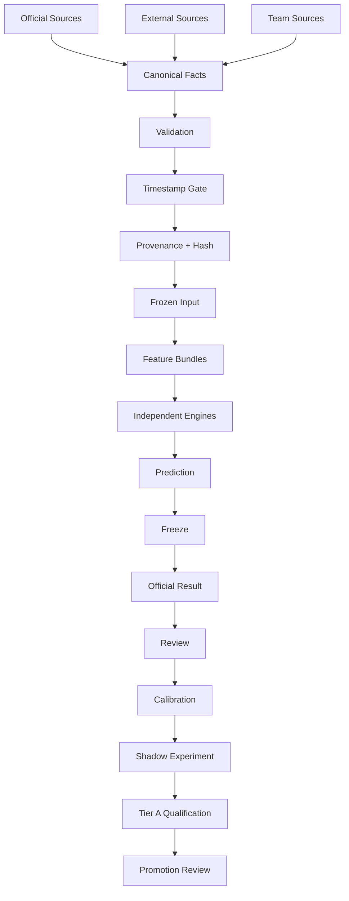

# JCFB V4.0 Data Flow

Status: V4-004 ARCHITECTURE ARTIFACT

## 1. Flow objective

This document defines how objective facts move through V4 without mixing source facts, derived intelligence, predictions, or post-match evidence. The flow is timestamp-gated, provenance-preserving, hashable, and compatible with separate V3.3.3 and V4 consumers.

## 2. Canonical data flow



The first six nodes are pre-match input control. The result, review, calibration, Shadow, Tier A, and Promotion path is post-freeze learning and governance. Post-match nodes cannot feed backward into a pre-match run.

## 3. Source classes and ownership

| Source class | Examples | Canonical ownership | Pre-match use |
|---|---|---|---|
| Official Sources | China Sports Lottery odds, official competition or result source | The relevant official source record | Allowed only when timestamped and available by cutoff |
| External Sources | European 1X2, Asian Handicap, Over/Under, public market facts | Source-specific external fact record | Allowed as external facts, never relabeled as official odds |
| Team Sources | Injuries, suspensions, lineup status, coach, schedule, weather, pitch | Source-specific team/match fact record | Allowed only with evidence lifecycle and freshness checks |
| Official Result | Official full-time and half-time result | Result authority | Post-match evaluation only; never a pre-match feature |

Canonicalization preserves the original source record. It does not erase conflicting observations or transform an interpretation into an objective fact.

## 4. Canonical facts

The Canonical Objective Facts Layer may contain:

- canonical match identity and competition
- kickoff time and timezone
- home and away team identity
- official handicap
- official China Sports Lottery odds for SPF, RQSPF, Total Goals, Exact Score, and Half-Full
- market availability
- Opening, Intermediate, Current, Latest, and Final snapshots
- external European 1X2, Asian Handicap, and Over/Under facts
- injuries, suspensions, lineup status, coach, schedule, weather, pitch, and official result

Every fact or snapshot supports `source`, `source_timestamp`, `observed_at`, `ingested_at`, `confidence`, `provenance`, and `hash`. A fact without sufficient identity or timestamp is `UNKNOWN` and cannot silently enter a formal run.

## 5. Validation and timestamp gate

Validation runs before any feature bundle is built. It checks:

1. identity completeness and canonical identity collisions
2. competition, kickoff, timezone, home, and away validity
3. official odds completeness and market availability
4. snapshot ordering and duplicate snapshots
5. source reliability, provenance, stale data, and conflicting observations
6. missing context and invalid or ambiguous kickoff data
7. future-information risk relative to the declared pre-match cutoff

The Timestamp Gate compares `published_at` and/or `source_timestamp`, `observed_at`, the declared `cutoff_at`, and kickoff time. The earliest defensible availability time is used for eligibility. `ingested_at` is audit metadata, not permission to use information that was unavailable at the cutoff.

The gate must reject:

- any fact first published or observed after the cutoff
- a future odds snapshot
- an official result or post-match statistic in a pre-match feature set
- a source record whose match identity cannot be resolved
- a critical fact with unresolvable conflict or missing provenance

## 6. Data Quality Engine 4.0 outputs

The quality layer publishes:

- `DATA_QUALITY_SCORE`
- `ODDS_QUALITY_SCORE`
- `CONTEXT_QUALITY_SCORE`
- `SOURCE_CONFIDENCE`
- `BLOCKERS[]`

Recommended blocker states are `UNKNOWN`, `UNAVAILABLE`, `CONFLICT`, `STALE`, `FUTURE_DATA`, `INVALID_IDENTITY`, and `BLOCKED`. Any critical blocker prevents Production Prediction and remains visible in the audit trail. Missing official markets are explicitly marked unavailable; they are never fabricated.

## 7. Provenance and snapshot lineage

After validation, the accepted fact set receives a deterministic snapshot identity. The planned lineage is:

```text
source records
    ↓
canonical fact snapshot
    ↓
validated fact snapshot hash
    ↓
feature bundles
    ↓
feature_snapshot_hash
    ↓
frozen_input_hash
```

The provenance record must make it possible to answer which source observation, at which time, entered a feature or prediction. Re-ingestion of the same source observation is idempotent or is recorded as a duplicate event; it must not silently change the accepted snapshot.

## 8. Frozen Input boundary

`Frozen Input 4.0` is created before a formal prediction. It freezes:

- canonical match identity, competition, kickoff, and timezone
- official odds snapshots used and market availability
- external market context used
- team and football context used
- feature bundle references and `feature_snapshot_hash`
- model versions and engine configurations
- cutoff and provenance references

The frozen record produces `frozen_input_hash`. Production, Shadow, and Experiment runs may be compared only when they use the same frozen input hash and declare their separate role.

## 9. Feature and engine handoff

Only validated and time-eligible data enters the Feature Representation Layer. It emits versioned bundles for statistical, football-context, market, league, tactical, score, and quality features. Engines consume feature bundles rather than arbitrary raw source rows.

The handoff retains:

- feature bundle version
- feature snapshot timestamp and cutoff
- source and evidence references
- quality and conflict flags
- `feature_snapshot_hash`

If a required bundle is incomplete, the result is `BLOCKED`, `UNKNOWN`, or `NOT_IMPLEMENTED`; a downstream layer must not invent a replacement.

## 10. Prediction, freeze, and result flow

Independent engines produce raw outputs. The Five-Market Orchestrator, consistency checks, risk decision, and Final Prediction Gate operate before the prediction becomes formal. A successful gate produces a Frozen Prediction that references the Frozen Input and stores its own `output_hash` and `frozen_at`.

After the match, Official Result Intake appends the result. Postmatch review compares the immutable frozen output against the result. It may attach post-match statistics as separately labeled evidence, but it must not mutate the Frozen Input or Frozen Prediction and must not make post-match data available to a later pre-match run.

## 11. Role-specific data flow

| Role | Input rule | Output rule |
|---|---|---|
| Production | Uses a valid Frozen Input and approved V4 configuration | Formal V4 prediction only after all gates pass |
| Shadow | Uses the same eligible Frozen Input when comparison is required | Isolated shadow output; no Production mutation |
| Experiment | Uses a declared input and experiment configuration | Research artifact; not a public formal prediction |

Role labels are part of audit identity. A Shadow or Experiment result cannot be copied into Production by a downstream read path.

## 12. No-future-leakage invariants

- Pre-match features cannot depend on Official Result.
- Pre-match features cannot depend on post-kickoff events or statistics.
- Future odds snapshots cannot be selected because they appear newer or more predictive.
- `ingested_at` cannot substitute for source availability time.
- Review and calibration data are append-only post-match artifacts.
- Reproducibility checks use the original cutoff, fact snapshot, feature hash, and frozen input hash.

## 13. Deferred implementation

This flow defines interfaces and gates only. It does not choose a database, implement ingestion, write model code, select a Score Engine algorithm, run simulation, import historical data, or publish a web page.

