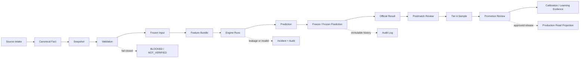

# JCFB V4 Data Lifecycle 1.0

Status: V4-009 DATA LIFECYCLE DESIGN ARTIFACT

## 1. Lifecycle objective

This document defines the persistent handoff from source intake to learning evidence. Every stage has an owner, a durable artifact, a gate, and an explicit failure outcome. The lifecycle is design-only; no stage is executed by V4-009.

## 2. End-to-end lifecycle



The public projection is a side output of an approved Production freeze/release path, not a successor that can feed the model. Match Explanation evidence is a separate postmatch branch and never flows back into Frozen Input or historical evaluation.

## 3. Stage definitions

| Stage | Persistent node(s) | Required gate | Output and failure behavior |
|---|---|---|---|
| Source Intake | intake audit, raw source reference, evidence/snapshot candidate | source attributable, no secret, replayable reference | append source observation; unknown time remains explicit |
| Canonical Fact | `competitions`, `teams`, `team_aliases`, `matches`, canonical identity hash | identity, home/away, timezone, daily key, provenance | append canonical fact; conflicts are `BLOCKED`/`REQUIRES_REVIEW` |
| Snapshot | official/external odds, Team Context, Evidence Items/Bundles | source type, availability, chronology, cutoff scope | append exact snapshot/claim; missing official market is explicit `UNAVAILABLE` |
| Validation | validation result/audit event | schema, refs, hashes, enum, time and role checks | pass or append `BLOCKED`/`NOT_VERIFIED`; no silent defaults |
| Frozen Input | `frozen_inputs` | exact refs/hashes, `cutoff < kickoff`, all critical availability times proven | immutable `FROZEN` input; reject or append a blocked revision |
| Feature Bundle | `feature_bundles` | one Frozen Input, feature schema/generator identity, typed missingness | append typed feature artifact; future leakage makes it blocked |
| Engine Runs | `engine_runs` | explicit role, version/hash, valid Feature/Frozen Input, run before kickoff | append `SUCCEEDED`, `FAILED`, `BLOCKED`, or `INVALID`; never fabricate output |
| Prediction | `predictions` | independent five markets, exact engine refs, risk/uncertainty/consensus | append role-scoped Prediction; invalid inputs cannot be formal |
| Freeze | `frozen_predictions` | Final Prediction Gate, immutability, role and hash checks | append immutable Frozen Prediction; failed gate blocks freeze |
| Official Result | `official_results` | exact canonical match identity, verified source, result scope | append verified result/revision; result cannot enter pre-match data |
| Review | `postmatch_reviews` | same match, correct review type and allowed inputs | append Model Evaluation or Match Explanation; no write-back |
| Tier A | `tier_a_samples` | genuine pre-match Production/Shadow pair, same Frozen Input hash, result/review, no leakage | append eligible or rejected evidence; Experiment denied |
| Promotion Review | `promotion_reviews` | Frozen Forward set, calibration, regression, integrity, leakage, performance and manual approval | append decision; approved review creates new Production release identity |
| Calibration / Learning Evidence | `calibration_records` and related evaluation refs | exact sample scope/market/model/role and immutable inputs | append stratified metrics; no automatic parameter or promotion change |

## 4. Time gates across the lifecycle

For every formal pre-match path:

```text
availability_at <= prediction_cutoff_at < kickoff_at
model_run_at < kickoff_at
```

`availability_at` is selected from the source-semantic time (`published_at`, `source_timestamp`, or `observed_at`) according to the accepted source policy. `ingested_at`, `generated_at`, `run_at`, and page-build time do not prove source availability.

The persisted chain must retain:

```text
source_timestamp
observed_at
ingested_at
prediction_cutoff_at
model_run_at / run_at
frozen_at
kickoff_at
```

If any critical time is unknown, conflicting, or after the cutoff, the downstream object is `NOT_VERIFIED`/`BLOCKED`. If future data enters the run, persist `future_information_leakage=true`, `RUN_INVALID=true`, `TIER_A_ELIGIBLE=false`, and `PROMOTION_EVIDENCE=false`; preserve the offending record.

## 5. Freeze and lineage gates

The Freeze Gate checks:

1. one canonical `match_id` and identity hash;
2. selected official odds snapshot IDs/hashes, including explicit unavailable states;
3. external snapshots marked external, never official;
4. Team Context and Evidence Bundle refs within cutoff;
5. exact feature schema, model, engine, config, dataset, and migration identities;
6. `prediction_cutoff_at < kickoff_at`;
7. recomputable `frozen_input_hash` and `provenance_hash`;
8. no result, event, postmatch evidence, or future odds reference;
9. `immutable=true` after sealing;
10. a complete audit event.

Only a passed Frozen Input may generate a formal Feature Bundle/Engine Run. A later correction creates a new input/revision; it never mutates a used input.

## 6. Role lifecycle

```text
EXPERIMENT -> new SHADOW revision -> PROMOTION_REVIEW -> new PRODUCTION release
```

This is an evidence route, not a row update. `DRAFT -> PRODUCTION`, `EXPERIMENT -> PRODUCTION`, Shadow without Promotion Review, and any role rename are prohibited. Production, Shadow, and Experiment runtime records are stored in separate role namespaces.

For a same-match Forward A/B:

- the Production and Shadow runs use the same `frozen_input_hash`;
- each run has its own role, revision, `input_hash`, `output_hash`, Prediction, and audit trace;
- Shadow completes before kickoff;
- Experiment is never a substitute for Shadow.

## 7. Result and review lifecycle

Official Result arrives only after the match and is stored under `evaluation`. Its default scope is `REGULATION_90_PLUS_STOPPAGE`; extra time and penalties remain auditable but do not silently change evaluation.

Two independent postmatch review paths exist:

### Model Evaluation

Reads only immutable Frozen Prediction, verified Official Result, and deterministic evaluation code/config identities. It produces hit/miss, Brier/Log Loss/MAE/score metrics, calibration inputs, and diagnostic attribution. It cannot read postmatch xG/events/interviews and cannot modify historical output.

### Match Explanation

May read postmatch events, xG, red cards, substitutions, technical statistics, or interviews. It produces explanatory evidence only. It cannot update `market_hit_results`, `score_metrics`, Frozen Input, Frozen Prediction, parameters, calibration history, or promotion evidence.

If a result is corrected, append a new result revision and a new review revision where needed. Keep the original review and its hashes.

## 8. Tier A and Promotion lifecycle

Tier A registration occurs only after the original pre-match artifacts, result, review, and all gates are present. A candidate must prove:

- V4 Tier A sequence beginning at `V4 Tier A Sample #001`;
- same match and same `frozen_input_hash` across Production/Shadow;
- pre-kickoff run completion;
- all required implementation/config/input/output hashes;
- no future information;
- completeness, integrity, and declared exclusion checks;
- no Experiment role in the Forward evidence.

Promotion Review aggregates immutable Tier A samples and evaluation sets, then records statistical, calibration, regression, performance, integrity, and no-leakage decisions plus manual approval. Approval creates a new Production release identity; it does not convert or edit the Shadow/Experiment record.

Calibration is persisted after evaluation as role/model/market/scope/confidence-band records with exact sample and result refs. It is learning evidence, not an automatic parameter update. A model change creates a new version and a new evidence period.

## 9. Audit events by stage

At minimum, append an Audit Log event for:

- source intake and canonical identity resolution;
- official/external snapshot and context/evidence intake;
- validation and gate rejection;
- Frozen Input creation/freeze/supersession;
- feature generation and Engine Run creation/completion/failure;
- Prediction and Frozen Prediction creation;
- result intake/verification/correction;
- Model Evaluation and Match Explanation creation;
- Tier A registration or rejection;
- Promotion Review, approval, withdrawal, rejection, release activation, retirement, and rollback;
- calibration calculation;
- incident detection, containment, recovery, and closure;
- public projection publication or withdrawal.

## 10. Terminal and recoverable states

`BLOCKED`, `INVALID`, `REJECTED`, `STALE`, `SUPERSEDED`, and `WITHDRAWN` do not erase data. A recovery path appends new identities and hashes, links the predecessor, and records why the old state remains ineligible. No process may restore eligibility by deleting the offending evidence.

## 11. V3.3.3 boundary

The lifecycle is V4-only. V3.3.3 results, reviews, samples, parameters, and audit history do not enter any V4 stage. A separately authorized benchmark is not a V4 lifecycle input and cannot become Tier A or Promotion evidence.
