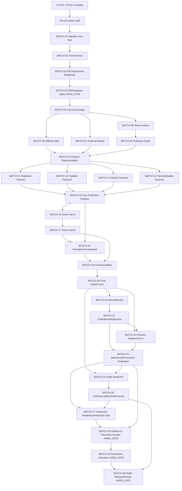

# JCFB V4 Dependency Graph 012–100 1.0

Status: V4-012–V4-100 DEPENDENCY AUDIT BLOCKED (SOURCE TASK REGISTER INCOMPLETE)

Graph Identity: `v4-dependency-graph-012-100@1.0.0`

Revision: `r001`

Audit Date: `2026-09-01` (`Asia/Shanghai`)

Execution Declaration: **NO V4-012+ TASK EXECUTED**

## 1. Graph scope and evidence boundary

This document records the verified edge `V4-011 → V4-012` and a candidate, acyclic dependency graph for the 30 batch envelopes in `docs/V4_BATCH_EXECUTION_PLAN.md`.

The graph is not a verified task graph for V4-013–V4-100 because the current Master Checklist has no source entries for those IDs. The missing task register is represented explicitly as a coverage gap; it is not silently replaced by inferred task names.

Known repository evidence:

- `V4-012` is named `Migration Dry-Run & Validation Harness Design 1.0` in the current README and V4-011 migration documents.
- `V4-013` through `V4-100` are absent from `docs/V4_MASTER_BUILD_CHECKLIST.md`, repository files, reachable branches/tags, and visible history.
- The existing V4-011 migration design requires dry-run, preflight, smoke, constraint, RLS, trigger, schema-diff, and acceptance evidence before a future Human Approver can authorize Production deployment.

## 2. Verified task edge

```text
V4-011 Database Migration Design 1.0
    ↓
V4-012 Migration Dry-Run & Validation Harness Design 1.0
```

No later task edge is verified from the repository. The following DAG is therefore a candidate batch-envelope graph and remains blocked for acceptance until the source task register is supplied.

## 3. Candidate batch DAG



## 4. Topological order

The candidate graph has this topological order. Fan-out and fan-in do not create a backward edge:

```text
BATCH-01,
BATCH-02,
BATCH-03,
BATCH-04,
BATCH-05,
BATCH-06/BATCH-07/BATCH-08,
BATCH-09,
BATCH-10,
BATCH-11/BATCH-12/BATCH-13/BATCH-14,
BATCH-15,
BATCH-16,
BATCH-17,
BATCH-18,
BATCH-19,
BATCH-20,
BATCH-21,
BATCH-22/BATCH-23,
BATCH-24,
BATCH-25,
BATCH-26,
BATCH-27,
BATCH-28,
BATCH-29,
BATCH-30
```

`BATCH-04`, `BATCH-27`, `BATCH-28`, `BATCH-29`, and `BATCH-30` are gate-only nodes. No ordinary implementation node may jump over them.

## 5. Dependency semantics

| Edge or fan-out | Meaning | Required control |
|---|---|---|
| V4-011 → V4-012 | V4-012 is the next known task after the completed migration design. | V4-012 remains not started in this audit. |
| BATCH-01 → BATCH-02 → BATCH-03 | Design, test-harness, and deployment-readiness ordering. | No target execution or write is permitted by the planning audit. |
| BATCH-04 → intake batches | Canonical storage/deployment boundary precedes formal intake. | BATCH-04 requires explicit Human Approver authorization. |
| BATCH-05 → BATCH-06/07/08 | Canonical identity and time boundary precede official, external, and context intake. | Official and external odds remain separate. |
| BATCH-06/07/09 → BATCH-10 | Feature representation consumes validated source/evidence envelopes. | No free-form unversioned engine input. |
| BATCH-11/12/13/14 → BATCH-15 | Independent feature families precede independent core engines. | Each engine retains its own identity and hashes. |
| BATCH-15/17/18 → BATCH-19 | Consensus consumes raw independent outputs and score/simulation evidence. | Disagreement cannot be erased by averaging. |
| BATCH-19 → BATCH-20 | Decision and risk gates precede freeze. | Failed prerequisites remain BLOCKED. |
| BATCH-20 → BATCH-21/23/25 | Frozen lineage precedes review, Forward Shadow pairing, and public-read design. | Public implementation remains read-only. |
| BATCH-22/23 → BATCH-24 | Calibration and Forward evidence precede benchmark/promotion evaluation. | Historical backtesting cannot replace Forward evidence. |
| BATCH-24/25/26 → BATCH-27 | Readiness includes evaluation, public safety, UI/observability, rollback, and historical integrity review. | Any historical-data modification is a separate HARD_GATE. |
| BATCH-27 → BATCH-28 → BATCH-29 → BATCH-30 | Human review, activation, and public release are strictly serial. | No automatic promotion or pointer switch. |

## 6. Cycle check

### 6.1 Candidate graph

Cycle check result: **PASS for the candidate batch-envelope graph**.

Method: the graph was reviewed against the topological order above; every edge points from an earlier position to a later position, and no node reaches an earlier ancestor. The only merge points are fan-in nodes, not back-edges.

### 6.2 Verified task coverage

Coverage result: **FAIL / NOT VERIFIABLE for V4-013–V4-100**.

The candidate graph cannot establish that every requested task has exactly one primary batch because those task names and dependencies are absent from the source checklist. This is a source-integrity failure, not a cycle in the candidate graph.

## 7. Hard-gate isolation

The following nodes cannot be crossed by graph traversal alone:

| Gate node | Gate | Required evidence before transition |
|---|---|---|
| BATCH-04 | Production DB Migration Apply / Supabase Schema Apply | Approved immutable manifest, preflight, disposable validation, catalog diff, smoke/RLS/trigger evidence, Human Approver authorization. |
| BATCH-27 | Frozen Prediction / Historical Integrity and Production Readiness | Append-only/history proof, backup/rollback decision, no-overwrite proof, explicit approval for any data-changing operation. |
| BATCH-28 | Shadow → Promotion Review | Pre-kickoff Forward Shadow, same frozen-input pairing where required, Tier A and integrity evidence, independent review. |
| BATCH-29 | Promotion Review → Production / Model Activation | New immutable Production identity, one-active-revision proof, compatibility/regression evidence, explicit Human Approver authorization. |
| BATCH-30 | Public Production Release / Canonical Output Pointer Switch | Safe projection review, approved Production source, pointer audit event, release identity, rollback target, explicit release approval. |

## 8. Restoration rule

When the original V4-012–V4-100 task register is restored, rerun the graph audit and require:

1. every task ID appears exactly once in the classification register;
2. every task has one primary batch and zero or more declared upstream edges;
3. every edge resolves to a known task or gate node;
4. Kahn-style topological processing removes all nodes with no residual edge and leaves no residual node;
5. no task is hidden inside a normal batch when it is a HARD_GATE;
6. the Master Checklist remains unchecked for every incomplete task.

Until these conditions pass, `Dependency Graph = BLOCKED` and V4-012 cannot begin.
