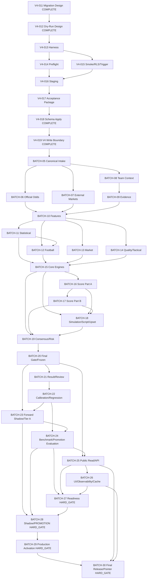

# JCFB V4 Dependency Graph 012–100 1.0

Status: `DEPENDENCY GRAPH PASS` / `BATCH-01 ACCEPTANCE PASS` / `BATCH-02 ACCEPTANCE PASS` / `BATCH-03 ACCEPTANCE PASS` / `BATCH-04 ACCEPTANCE PASS` / `V4-020 ACCEPTANCE PASS` / `BATCH-05 IN PROGRESS`

Graph Identity: `v4-dependency-graph-012-100@1.0.0`
Revision: `r003`
Audit Date: `2026-09-04` (`Asia/Shanghai`)
Execution Declaration: **BATCH-04 PRODUCTION SCHEMA APPLY AND V4 WRITE BOUNDARY ACCEPTED; NO MODEL, SHADOW, OR PUBLIC RELEASE EXECUTION**

## 1. Scope and evidence boundary

This is the approved planning DAG for V4-012–V4-100. The task-level edges are fully listed in `docs/V4_TASK_DEPENDENCY_REGISTER.md`; the batch-level structure below is a compact visual view.

V4-011 -> V4-012 is the only predecessor edge recovered from repository history. V4-013–V4-100 names and later edges are reconstructed from approved architecture and contracts. The distinction is preserved; no reconstructed edge is presented as historical evidence.

## 2. Task-level DAG



## 3. Batch edge register

| Batch | Upstream | Primary task IDs | Edge meaning |
|---|---|---|---|
| BATCH-01 | V4-011 | V4-012 | Migration Dry-Run & Validation Harness; child edges are in the task dependency register. |
| BATCH-02 | BATCH-01 | V4-013–V4-015 | Dry-Run, Preflight & Negative Test Harness; child edges are in the task dependency register. |
| BATCH-03 | BATCH-02 | V4-016–V4-017 | Staging Readiness & Migration Acceptance Package; child edges are in the task dependency register. |
| BATCH-04 | BATCH-03 | V4-018–V4-019 | Formal Schema Apply & Production DB Write HARD_GATE; child edges are in the task dependency register. |
| BATCH-05 | BATCH-04 | V4-020–V4-023 | Canonical Data Intake Foundation; child edges are in the task dependency register. |
| BATCH-06 | BATCH-05 | V4-024–V4-027 | Official China Sports Lottery Odds Intake; child edges are in the task dependency register. |
| BATCH-07 | BATCH-05 | V4-028–V4-031 | External Market Intake & Time Normalization; child edges are in the task dependency register. |
| BATCH-08 | BATCH-05 | V4-032–V4-035 | Team Context Intake; child edges are in the task dependency register. |
| BATCH-09 | BATCH-08 | V4-036–V4-037 | Evidence Graph & Source Conflict Handling; child edges are in the task dependency register. |
| BATCH-10 | BATCH-06, BATCH-07, BATCH-09 | V4-038–V4-040 | Feature Representation Layer; Feature Bundle is upstream of downstream V4-076 Frozen Input; child edges are in the task dependency register. |
| BATCH-11 | BATCH-10 | V4-041–V4-043 | Statistical Strength Feature Engines; child edges are in the task dependency register. |
| BATCH-12 | BATCH-10, BATCH-11 | V4-044–V4-045 | Governance-amended upstream set; Football Intelligence & Context Feature Engines; child edges are in the task dependency register. |
| BATCH-13 | BATCH-06, BATCH-07, BATCH-10 | V4-046–V4-048 | Market Intelligence Feature Engines; child edges are in the task dependency register. |
| BATCH-14 | BATCH-09, BATCH-10, BATCH-12 | V4-049–V4-051 | Tactical, Quality & Provenance Gates; child edges are in the task dependency register. |
| BATCH-15 | BATCH-11, BATCH-12, BATCH-13, BATCH-14 | V4-052–V4-055 | Core Prediction Engines: Outcome / Handicap / Goals / HTFT; child edges are in the task dependency register. |
| BATCH-16 | BATCH-11, BATCH-15 | V4-056–V4-059 | Score Engine Part A: Lambda / Distribution / Variance; child edges are in the task dependency register. |
| BATCH-17 | BATCH-16 | V4-060–V4-064 | Score Engine Part B: Matrix / Candidates / Selector / Diversity; child edges are in the task dependency register. |
| BATCH-18 | BATCH-15, BATCH-16, BATCH-17 | V4-065–V4-068 | Match Simulation / Match Script / Upset; child edges are in the task dependency register. |
| BATCH-19 | BATCH-15, BATCH-17, BATCH-18 | V4-069–V4-073 | Consensus / Disagreement / Uncertainty / Risk / Consistency; child edges are in the task dependency register. |
| BATCH-20 | BATCH-19 | V4-074–V4-077 | Five-Market Orchestrator / Final Gate / Frozen Lineage; child edges are in the task dependency register. |
| BATCH-21 | BATCH-20 | V4-078–V4-081 | Official Result / Postmatch Review / Error Attribution; child edges are in the task dependency register. |
| BATCH-22 | BATCH-21 | V4-082–V4-084 | Calibration / League Profiles / Regression Evaluation; child edges are in the task dependency register. |
| BATCH-23 | BATCH-20, BATCH-22 | V4-085–V4-087 | Forward Shadow Pair / Tier A Collection Infrastructure; child edges are in the task dependency register. |
| BATCH-24 | BATCH-22, BATCH-23 | V4-088–V4-089 | Cross-Version Benchmark / Promotion Evaluation; child edges are in the task dependency register. |
| BATCH-25 | BATCH-20, BATCH-24 | V4-090–V4-091 | Public Read Projection / Canonical Data Center API; child edges are in the task dependency register. |
| BATCH-26 | BATCH-25 | V4-092–V4-094 | Public UI / Observability / Performance; child edges are in the task dependency register. |
| BATCH-27 | BATCH-24, BATCH-25, BATCH-26 | V4-095–V4-097 | Security / DR / Release Candidate / Production Readiness HARD_GATE; child edges are in the task dependency register. |
| BATCH-28 | BATCH-23, BATCH-24, BATCH-27 | V4-098 | Shadow-Only Pilot -> Promotion Review HARD_GATE; child edges are in the task dependency register. |
| BATCH-29 | BATCH-28 | V4-099 | Promotion Review -> Production Activation HARD_GATE; child edges are in the task dependency register. |
| BATCH-30 | BATCH-25, BATCH-26, BATCH-29 | V4-100 | Final Production Release / Canonical Pointer Switch / Closure HARD_GATE; child edges are in the task dependency register. |

## BATCH-12 governance resolution override

The current approved batch-level upstream set is `BATCH-10, BATCH-11`. The
task-level path remains `V4-040 + V4-043 -> V4-044 -> V4-045`. This section
records the governance amendment and its rationale; it does not change task
IDs or introduce a dependency cycle.

## 4. Topological order

```text
BATCH-01, BATCH-02, BATCH-03, BATCH-04, BATCH-05,
BATCH-06/BATCH-07/BATCH-08, BATCH-09, BATCH-10,
BATCH-11, BATCH-12/BATCH-13/BATCH-14, BATCH-15, BATCH-16, BATCH-17, BATCH-18, BATCH-19, BATCH-20,
BATCH-21, BATCH-22, BATCH-23, BATCH-24, BATCH-25, BATCH-26,
BATCH-27, BATCH-28, BATCH-29, BATCH-30
```

The fan-out groups are parallel development opportunities only after their upstream contracts are accepted. Fan-in tasks remain blocked until every required upstream edge is PASS.

For BATCH-11, acceptance of the task edge from BATCH-10 also requires the approved `historical-statistical-input@1.0.0` contract and `statistical-strength-config@1.0.0`. These contract prerequisites do not add a graph node or change the BATCH-10 -> BATCH-11 -> later-batch topology.

## 5. Hard-gate cut points

| Gate node | Task | Required transition evidence |
|---|---|---|
| BATCH-04 | V4-018 and V4-019 | Exact manifest, schema apply, V4 write boundary, separate approvals, V3 isolation |
| BATCH-27 | V4-097 | E2E dry run, security, restore, rollback, regression, public safety, readiness approval |
| BATCH-28 | V4-098 | Real pre-kickoff Shadow, same-hash pairing, Tier A completeness, independent Promotion Review |
| BATCH-29 | V4-099 | New immutable Production identity, one active revision, rollback target, explicit approval |
| BATCH-30 | V4-100 | Approved release identity, safe projection, canonical pointer event, monitoring and closure |

## 6. Cycle and coverage result

- Task IDs covered: `V4-012–V4-100` = `89/89`.
- Primary batch assignments: `89/89`, exactly one each.
- Missing task IDs: `0`; duplicate task IDs: `0`; orphan dependency references: `0`.
- Kahn-style cycle check: all task and batch nodes removed; residual nodes `0`; dependency cycles `0`.
- The only historical edge is V4-011 -> V4-012. All later edges are explicitly reconstructed planning edges.

No graph edge authorizes execution. BATCH-01 through BATCH-04 are accepted within their recorded scopes; BATCH-04 crossed its Production hard gate only after explicit approval and final verification. BATCH-05 is in progress only for the explicitly scoped V4-020 local no-write task; V4-021 through V4-023 remain separate child tasks.

## BATCH-13 market intelligence governance resolution override

The BATCH-13 task path is explicitly serial for acceptance:

```text
V4-040 + V4-027 + V4-031 -> V4-046 -> V4-047 -> V4-048 -> Closure
```

The Batch Plan's parallel-development phrase is limited to independent
internal preparation. It cannot create a parallel acceptance path around the
registered V4-047 -> V4-048 edge. V4-046 through V4-048 are pre-Frozen market
feature artifacts governed by the five versioned BATCH-13 contracts/config
artifacts and do not require Frozen Input or formal Engine Output.
