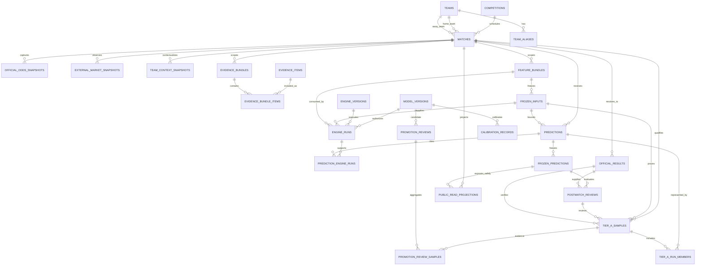

# JCFB V4 Entity Relationship Model 1.0

Status: V4-009 LOGICAL RELATIONSHIP DESIGN ARTIFACT

## 1. Purpose and relationship authority

This document is the relationship view of `docs/V4_CANONICAL_DATA_MODEL.md`. It defines cardinality, foreign-key intent, revision-chain rules, same-match checks, role isolation, and the core lineage path. It is not SQL and does not create a database object.

The V4-008 contract references are authoritative for field meaning. The Constitution is authoritative for immutability, no future information, role isolation, Promotion, Public Web, and V3.3.3 protection.

## 2. Core ER diagram



`INCIDENTS` and `AUDIT_LOGS` are generic governance relations. They reference any allowed entity by typed `entity_type + entity_id` (and, where applicable, `match_id`, role, and run identity); they do not create an untyped business foreign key that can bypass validation.

## 3. Relationship contract

### 3.1 Canonical facts and source observations

- `competitions 1:N matches`; a match has exactly one canonical competition reference at a given revision.
- `teams 1:N team_aliases`; aliases resolve to a stable `team_id`, never the reverse by display name alone.
- `teams 1:N matches` twice, once as `home_team_id` and once as `away_team_id`; the two IDs must differ.
- `matches 1:N official_odds_snapshots`; each snapshot has one `match_id` and exact official source/capture identity.
- `matches 1:N external_market_snapshots`; each external snapshot is explicitly non-official and cannot satisfy an official odds FK.
- `matches 1:N team_context_snapshots`; a context snapshot is scoped to one team and one `HOME`/`AWAY` side for a match.
- `evidence_items N:M evidence_bundles` through `evidence_bundle_items`; membership records stable item order, inclusion state, cutoff scope, and the item hash used.

### 3.2 Frozen Input lineage

The required lineage is:

```text
MATCH
  -> selected OFFICIAL_ODDS_SNAPSHOTS
  -> selected EXTERNAL_MARKET_SNAPSHOTS (optional but explicit)
  -> TEAM_CONTEXT_SNAPSHOTS
  -> EVIDENCE_BUNDLE
  -> FEATURE_SCHEMA / registry identities
  -> FEATURE_BUNDLE
  -> FROZEN_INPUT
  -> ENGINE_RUNS
  -> PREDICTION
  -> FROZEN_PREDICTION
```

`frozen_inputs` is a many-to-one child of `matches` (`match 1:N frozen_input revisions`). A Frozen Input stores exact upstream IDs and hashes; a label such as “latest odds” is not a valid relationship.

`feature_bundles` is a typed representation of accepted upstream lineage and does not require a Frozen Input. `frozen_inputs N:1 feature_bundles`; each Frozen Input must preserve the exact Feature Bundle ID and `feature_snapshot_hash`, together with the other approved source references. An Engine Run must point to the exact Feature Bundle it consumed and the exact Frozen Input hash.

`engine_runs N:1 frozen_inputs` and `engine_runs N:1 feature_bundles`. Each run also points to one exact `model_version` and one exact `engine_version`; `role`, `revision`, implementation/config/input/output hashes, and execution timestamps are immutable run identity evidence.

### 3.3 Engine Runs, Predictions, and Frozen Predictions

`predictions N:1 matches`, `predictions N:1 frozen_inputs`, and `predictions N:M engine_runs` through `prediction_engine_runs`.

The join model is required because one Prediction can cite multiple independent Engine Runs: five market engines plus consensus, uncertainty, risk, or other governed layers. It must retain `market`, `lineage_purpose`, `engine_run_id`, `output_hash`, and sequence. It cannot store a free-text list that bypasses exact IDs.

`frozen_predictions N:1 predictions`. A Frozen Prediction is a write-once snapshot of one Prediction, with `prediction_hash`, `frozen_snapshot_hash`, `freeze_revision`, role, match, Frozen Input hash, and `supersedes_frozen_prediction_id`. The Prediction and Frozen Prediction must resolve to the same match and role identity.

### 3.4 Results and Reviews

`matches 1:N official_results` physically because corrections are revisions. Logically, a match has exactly one current canonical Official Result pointer at a time; every prior result revision remains addressable through `supersedes_result_id`.

`postmatch_reviews N:1 frozen_predictions` and `postmatch_reviews N:1 official_results`. A review must validate that both references resolve to the same match. `MODEL_EVALUATION` reads only the Frozen Prediction and Official Result plus deterministic evaluator identity. `MATCH_EXPLANATION` may reference postmatch evidence but cannot write into evaluation, frozen artifacts, or promotion history.

### 3.5 Tier A and Promotion

`tier_a_samples` references:

- one `match_id`;
- one immutable `frozen_input_id/hash`;
- the Production Prediction/Frozen Prediction and, when required, the Shadow Prediction/Frozen Prediction;
- the pre-kickoff Engine Run/Prediction identities through `tier_a_run_members`;
- one verified Official Result and the relevant Postmatch Review;
- implementation/config/input/output hashes and no-leakage gate evidence.

The Production and Shadow members must have the same `match_id` and the same `frozen_input_hash`. An Experiment member is invalid for Forward Tier A even if it happens to use the same hash.

`promotion_reviews N:M tier_a_samples` through `promotion_review_samples`, plus typed references to calibration, regression, integrity, performance, and leakage evaluations. A Promotion Review aggregates immutable evidence; it does not merge or mutate sample/output rows.

### 3.6 Public projection and governance

`public_read_projections N:1 matches` and references one canonical Production Frozen Prediction plus public-safe odds/result metadata. Shadow and Experiment references are rejected by relationship validation. A projection revision is appended by the Production publication gate; Public Web has read-only access.

`model_versions 1:N engine_runs`, `engine_versions 1:N engine_runs`, and `model_versions 1:N promotion_reviews/calibration_records`. Active Production uniqueness is maintained by a governance pointer scoped to `(model_family, canonical_output_channel)`, not by choosing the newest row.

## 4. Revision and supersession graph

Every revision chain has the same shape:

```text
current revision
    --supersedes_*_id--> previous revision
        --supersedes_*_id--> earlier revision
            -> NOT_APPLICABLE at the root
```

Required chain fields:

| Chain | New revision carries | Forbidden |
|---|---|---|
| Frozen Input | `frozen_input_revision`, `supersedes_frozen_input_id`, reason, actor, time, new hashes | updating a used input or reusing its hash |
| Prediction | `prediction_revision`, `supersedes_prediction_id`, role/model/input/output identities | editing historical probability, direction, confidence, or risk |
| Frozen Prediction | `freeze_revision`, `supersedes_frozen_prediction_id`, immutable snapshot and new hashes | changing an existing frozen snapshot |
| Official Result | `result_revision`, `supersedes_result_id`, before/after correction evidence, new result hash | overwriting the result used by prior evaluation |
| Postmatch Review | `review_revision`, `supersedes_review_id`, factual correction reason and new review hash | changing evaluation to improve KPI or silently adding postmatch evidence |
| Model/Engine release | new role-scoped revision, predecessor, effective time, approval and evidence | relabeling Shadow/Experiment as Production or silently reactivating a retired identity |

The current row is derived from an auditable active pointer or a validated terminal chain. `latest`, `current`, and `default` are query results, never stored identities.

## 5. Same-match and same-input invariants

The following invariants are cross-entity checks, not optional comments:

```text
prediction.match_id = frozen_input.match_id
prediction_engine_runs.match_id = prediction.match_id
frozen_prediction.match_id = prediction.match_id
review.frozen_prediction.match_id = review.result.match_id
tier_a.production.match_id = tier_a.shadow.match_id = tier_a.match_id
tier_a.production.frozen_input_hash = tier_a.shadow.frozen_input_hash
public_projection.role = PRODUCTION
public_projection.frozen_prediction.role = PRODUCTION
```

Production/Shadow A/B may have different `input_hash` values because role and component identities are part of the Engine Output envelope. They must share `canonical_match_identity`, `prediction_cutoff_at`, and `frozen_input_hash`.

## 6. Role and write isolation

Role is a required field on `engine_runs`, `predictions`, and role-owned frozen/output records. `frozen_inputs` is a shared lineage artifact for a formal A/B pair and therefore does not put role into its substantive hash; the consumer records role and comparison mode. An Experiment-owned Frozen Input is explicitly `EXPERIMENT_ONLY` and cannot become the shared Production/Shadow input by relabeling.

| Relationship or write | Production | Shadow | Experiment |
|---|---|---|---|
| Read Canonical Facts and approved source snapshots | allowed read | allowed read | allowed read |
| Write shared Production Frozen Input | Freeze Gate only | denied | denied |
| Append own Feature/Engine/Prediction records | Production namespace | Shadow namespace | Experiment namespace |
| Write Production Frozen Prediction | Final Prediction Gate only | denied | denied |
| Write Tier A | Promotion Review only after gates | denied | denied |
| Write active Production pointer/public projection | Production publication gate only | denied | denied |

No relationship edge grants permission to cross a role namespace or mutate an immutable predecessor.

## 7. Referential failure outcomes

| Failure | Required outcome |
|---|---|
| unresolved match/team/competition identity | `BLOCKED`; retain source/conflict evidence |
| snapshot hash or source role mismatch | `BLOCKED`; no external-to-official coercion |
| Frozen Input reference not exact or cutoff not provable | `REJECTED`/`BLOCKED`; no formal run |
| Prediction/Frozen Input match mismatch | reject as referential integrity violation; open incident if admitted |
| review result/Frozen Prediction match mismatch | review invalid; no evaluation or Tier A |
| Production/Shadow hash mismatch | `PAIR_INVALID`; `TIER_A_ELIGIBLE=false` |
| Experiment presented as Shadow/Tier A | role violation; preserve incident and deny promotion evidence |
| public projection points to non-Production record | publication incident; block/withdraw projection revision |

## 8. V3.3.3 boundary

No ER edge in this model points to a JCFB V3.3.3 artifact. Cross-version benchmarking, if later authorized, must use a separately named read-only adapter and must not merge IDs, copy predictions, or mutate either model line.
