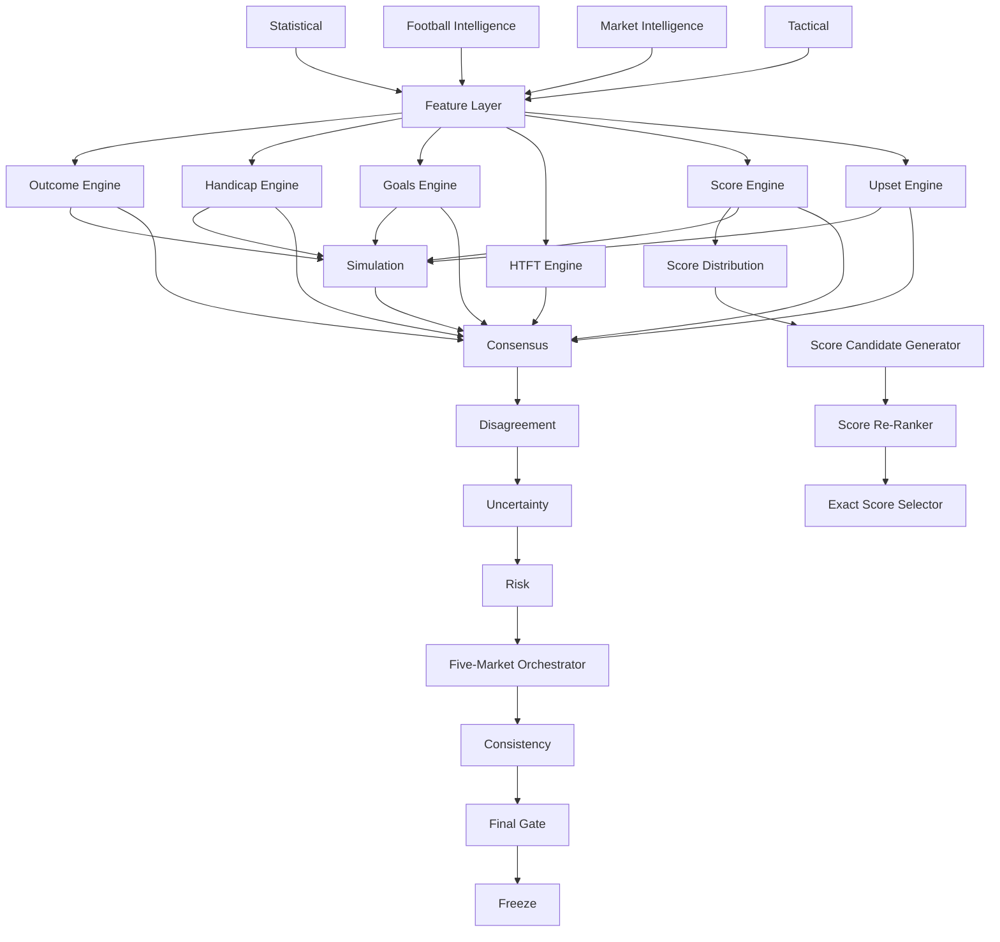

# JCFB V4.0 Model Flow

Status: V4-004 COMPLETE

## 1. Model flow objective

V4 uses independent model judgments that are assembled only after each engine has produced a traceable output. The model flow separates feature representation, distribution estimation, score selection, simulation, consensus, uncertainty, risk, market orchestration, and freezing.

## 2. End-to-end model flow



## 3. Feature handoff

The Feature Representation Layer is the only normal handoff between intelligence and prediction engines. It creates versioned bundles for:

- `statistical_features`
- `football_context_features`
- `market_features`
- `league_features`
- `tactical_features`
- `score_features`
- `quality_features`

Every bundle is timestamped, reproducible, and hashable. `feature_snapshot_hash` identifies the complete feature snapshot used by a run. Engines may select declared subsets, but they may not silently read raw, unversioned inputs.

## 4. Independent engine contracts

| Engine | Required responsibility | Output boundary |
|---|---|---|
| Outcome Engine 4.0 | Home / Draw / Away probability | Own directional output and metadata |
| Handicap Engine 4.0 | Handicap outcome and goal-difference distribution | Own handicap output and metadata |
| Goals Engine 4.0 | 0–7+ goal distribution and goal bands | Own total-goals output and metadata |
| HTFT Engine 4.0 | Nine Half-Full states | Own HTFT output and metadata |
| Score Engine 4.0 | Full exact-score probability distribution | Distribution only; no result access |
| Upset Engine 4.0 | Favorite-failure and upset probability | Independent upset signal and drivers |

Each run retains:

```text
engine_version
implementation_hash
config_hash
input_hash
output_hash
run_at
runtime_ms
```

The complete V4 run identity additionally includes product, model, selector, config, schema, migration, dataset, Frozen, role-scoped revision, lifecycle, compatibility, and runtime fields defined in `docs/V4_VERSION_IDENTITY_CONTRACT.md`.

An engine output must identify its role as `PRODUCTION`, `SHADOW`, or `EXPERIMENT`. Raw output is retained even when a downstream gate rejects it.

## 5. Statistical and intelligence inputs

The Statistical Strength Model 4.0 plans Dynamic Team Rating, attack, defence, home advantage, opponent adjustment, form decay, league strength, and promotion/relegation adjustment. It must support time decay, sample-size awareness, and opponent adjustment. Recent results alone do not authorize a large rating change. Historical results and match statistics are eligible only through the target-scoped `historical-statistical-input@1.0.0` contract; the target match's own result/statistics remain prohibited.

Football Intelligence supplies context features, evidence conflicts, and risk flags. Market Intelligence supplies timestamped movement, direction, heat, divergence, liquidity/availability quality, and trap-risk signals. A trap signal is a risk input, not a fact about intent.

## 6. Score distribution and selection

Score estimation and score selection are separate stages:

```text
context, statistical, tactical, and market score features
        ↓
Dynamic Lambda Engine
        ↓
Distribution Ensemble
        ↓
Goal Variance / Correlation
        ↓
Score Matrix
        ↓
Score Candidate Generator 4.0
        ↓
Top20 candidate scores
        ↓
Score Re-Ranker
        ↓
Scenario Diversity Selector
        ↓
Exact Score Selector 4.0
        ↓
Top1 / Top2 / Top3 / Top5 / Top10
```

Dynamic λ Home and Dynamic λ Away, BTTS, Clean Sheet, Goal Variance, Distribution Ensemble, Correlation Adjustment, and Score Matrix are planned interfaces. Poisson, Dixon-Coles, Bivariate Poisson, and Negative Binomial/over-dispersion remain research candidates; this blueprint does not select a Production algorithm or parameter set.

The selector cannot rewrite the probability distribution. Scenario Diversity Selector may reduce path redundancy and improve coverage of materially different Match Scripts, but its decisions remain traceable.

## 7. Simulation and Match Script

`Match Simulation Engine 1.0` is independent from each deterministic engine and supports future Monte Carlo evaluation. Blueprint stage does not fix the number of runs. Planned state nodes are 0', 15', 30', HT, 60', 75', and FT. Planned factors include goal events, game state, leading/trailing behavior, tempo, fatigue, substitution depth, red-card stochastic events, and tactical shifts.

`Match Script Engine 4.0` may identify `HOME_CONTROL`, `AWAY_CONTROL`, `BALANCED_LOW_EVENT`, `BALANCED_OPEN`, `HOME_EARLY_LEAD`, `AWAY_EARLY_LEAD`, `LATE_BREAK`, `HIGH_VARIANCE`, `COMEBACK_PRONE`, and `DRAW_PRESSURE`. Match Script affects simulation, reranking, risk, and scenario diversity only; it cannot replace Score Distribution.

Planned simulation outputs include win, draw, loss, first goal, HT state, comeback, 3+ goals, BTTS, clean sheet, score distribution, and match scripts. These are output contracts, not implemented algorithms.

## 8. Consensus and disagreement

`Cross-Model Consensus Engine 4.0` consumes raw outputs from the Statistical Model, Football Intelligence, Market Intelligence, Outcome, Goals, Score, Simulation, and Upset layers. It produces:

- `CONSENSUS_SCORE`
- `DIRECTIONAL_CONSENSUS`
- `MODEL_VOTES`
- `ENGINE_SUPPORT`
- `ENGINE_CONFLICTS`

Consensus is not defined as simple probability averaging. Each original engine output, input hash, role, and configuration remains accessible.

`Model Disagreement Index 1.0` measures whether a consensus reflects genuine agreement or hides dispersion. It emits `LOW`, `MEDIUM`, `HIGH`, or `EXTREME` and `numeric_disagreement_score`.

## 9. Uncertainty, risk, and abstention

`Uncertainty Engine 4.0` considers data uncertainty, context uncertainty, market uncertainty, model disagreement, distribution entropy, simulation variance, calibration reliability, missing evidence, and league sample quality. It emits prediction uncertainty, confidence interval, and confidence grade. Model probability is not confidence.

`Risk & Abstention Engine 4.0` evaluates data, market, context, upset, volatility, and model-conflict risk. It may emit `PASS`, `CAUTION`, `ELIGIBLE`, `HIGH_CONFIDENCE`, or `NO STRONG RECOMMENDATION`. Abstention is a valid output and a strong recommendation is not mandatory.

## 10. Five-Market Orchestrator and consistency

`Five-Market Prediction Orchestrator 4.0` assembles:

- SPF
- RQSPF
- Total Goals
- Exact Score
- Half-Full

The ordering is independent engine first, cross-market consistency second. Outcome Engine output cannot mechanically determine all five markets.

`Prediction Consistency Engine 4.0` checks contradictions such as a high home-win probability paired with exclusively away-winning Top2 scores, or a low-goal recommendation paired with only high-score candidates. It records `CONSISTENCY_CONFLICT` and passes the conflict to the Orchestrator and Risk Engine. It may not silently alter an engine output.

## 11. Final gate and frozen model run

The Final Prediction Gate requires match identity, official odds, timestamp validity, no future data, non-blocked data/context quality, complete engine outputs, acceptable consistency, and a non-blocked risk gate. A formal prediction is created only after the gate passes.

Feature Bundle is assembled before prediction freeze from the exact accepted facts, snapshots, context, and Evidence references. Frozen Input then records the exact Feature Bundle (`feature_bundle_id` and `feature_snapshot_hash`) together with the approved facts, snapshots, context, model versions, and engine configurations used. Production, Shadow, and Experiment are comparable only when they use the same `frozen_input_hash`. Frozen Prediction then stores output references, consensus, disagreement, uncertainty, risk, model version, input hash, output hash, and freeze time as an immutable append-only record.

## 12. Postmatch and evaluation separation

Postmatch Review consumes Frozen Prediction plus Official Result. It separately labels Prediction Evaluation and Match Explanation. Review, calibration, and Error Attribution are post-match artifacts and cannot write backward into the pre-match feature or frozen records.

Cross-Version Benchmark compares independently frozen V3.3.3 and V4 outputs without modifying either model line. V4 Tier A starts at `V4 Tier A Sample #001` and requires complete frozen, hash, result, and no-leakage evidence.

## 13. Deferred implementation

This model flow defines contracts and boundaries only. It does not implement Python model code, choose Production algorithms, train or backtest models, run simulation, create a database, create a Production or Shadow model, or generate a match prediction.
